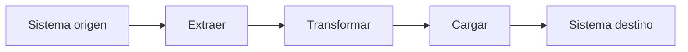
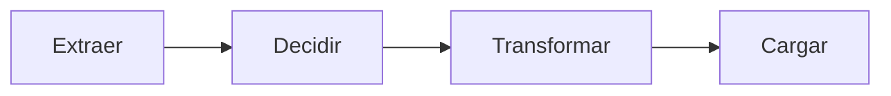
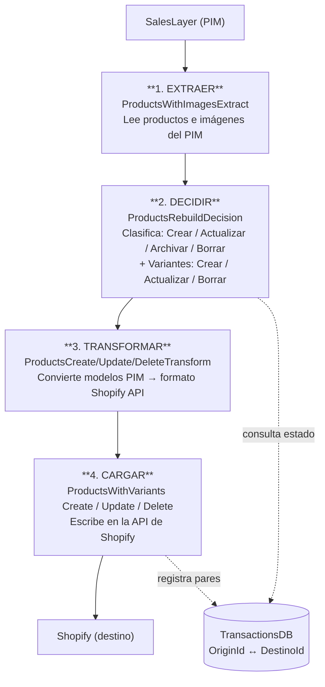
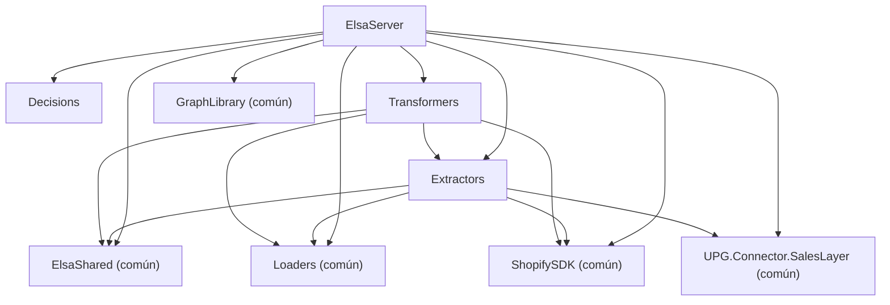

---
tags:
  - Arquitectura
  - ETL
---

# 01 — Arquitectura general: el patrón ETL

## ¿Qué es ETL?

**ETL** son las siglas de **Extract, Transform, Load** (Extraer, Transformar, Cargar). Es un patrón de diseño muy usado en sistemas de integración de datos. La idea es simple: cuando tienes dos sistemas que manejan los mismos datos de forma diferente, necesitas un proceso en el medio que los sincronice.



En este proyecto:

- **Sistema origen**: Provalliance (ERP) y SalesLayer (PIM)
- **Sistema destino**: Shopify B2B

---

## La versión extendida de este proyecto: ETDTL

En la práctica, este proyecto añade un paso extra entre Extraer y Transformar: la **Decisión**. Esto es porque no basta con coger todos los datos del origen y volcarlos en el destino — hay que comparar qué hay en cada sistema para saber qué crear, qué actualizar y qué eliminar.



Cada uno de estos pasos está implementado en un proyecto .NET separado.

---

## Los proyectos del repositorio

### Proyectos propios de este repo (específicos de Provalliance)

```
UPG.Pataky/
├── Extractors/         ← Lee datos de las APIs externas
├── Decisions/          ← Decide qué crear, actualizar o borrar
├── Transformers/       ← Convierte los datos al formato de Shopify
├── ElsaServer/         ← Orquesta todo: aquí se definen y ejecutan los workflows
├── ElsaStudio.Web/     ← Interfaz web para ver y controlar los workflows
└── ElsaStudio.WebAssembly/   ← Variante WebAssembly de la misma interfaz
```

### Proyectos comunes (compartidos con otros clientes de Upango)

Estos proyectos viven en otros repositorios pero se incluyen como referencias en la solución:

```
Comunes/
├── UPG.Pataky.Shared/
│   ├── ElsaShared/     ← Actividades, modelos y servicios base de Elsa
│   └── Loaders/        ← Actividades que escriben en Shopify (vía API)
├── UPG.ShopifySDK/     ← SDK propio para la API de Shopify
├── UPG.SharedUtils/    ← Utilidades genéricas de C#
├── UPG.Connector.SalesLayer/  ← Conector con el PIM SalesLayer
└── GraphLibrary/       ← Cliente de Microsoft Graph (para enviar emails)
```

> La separación entre lo "propio" y lo "común" es clave: todo lo que podría reutilizarse en otro proyecto de Upango vive en `Comunes`. Lo que es exclusivo de Provalliance vive en este repo.

---

## El flujo completo de datos

### Ejemplo: sincronización de Productos



### Ejemplo: sincronización de Stock (más sencilla)

```
Provalliance API  ──►  StockExtract  ──►  StockTransform  ──►  SyncStock  ──►  Shopify
```

En este caso no hay paso de Decisión porque el stock es un valor absoluto: simplemente se sobreescribe lo que hay.

---

## Responsabilidad de cada capa

### Extractors — "¿Qué hay en el origen?"

- Se conecta a las APIs externas: la API REST de Provalliance y la API de SalesLayer.
- Autentica las peticiones (OAuth2 para Provalliance, API Key para SalesLayer).
- Devuelve los datos en modelos propios de este repo (por ejemplo, `ClientResponseModel`, `Product`).
- **No sabe nada de Shopify.**

Ficheros principales:
```
Extractors/
├── CustomerExtract.cs          ← Clientes desde la API de Provalliance
├── StockExtract.cs             ← Stock desde la API de Provalliance
├── ProductsWithImagesExtract.cs ← Productos desde SalesLayer
├── PicsLocalExtractor.cs       ← Imágenes desde FTP
├── Services/
│   ├── ProvallianceService.cs  ← Cliente HTTP para la API de Provalliance
│   └── ProvallianceAuthenticationHelperService.cs  ← Gestión del token OAuth2
└── Models/
    ├── ClientResponseModel.cs  ← Modelo de respuesta de la API de clientes
    ├── Product.cs              ← Modelo de producto del PIM
    └── Stock.cs                ← Modelo de stock
```

### Decisions — "¿Qué hay que hacer?"

- Compara los datos del origen con el estado actual de Shopify.
- Clasifica los registros en listas: crear, actualizar, borrar.
- Es la capa que requiere más lógica de negocio.
- **Sabe tanto del origen como del destino.**

Ficheros:
```
Decisions/
└── ProductsRebuildDecision.cs  ← Decisión para el workflow de productos
```

### Transformers — "¿Cómo lo decimos en Shopify?"

- Recibe los datos ya clasificados de la capa de Decisión.
- Los convierte al formato exacto que pide la API de Shopify.
- Usa **AutoMapper** con perfiles de mapeo para las conversiones complejas.
- **No llama a ninguna API.**

Ficheros principales:
```
Transformers/
├── CustomerTransform.cs        ← Transforma clientes/companies para Shopify
├── StockTransform.cs           ← Transforma el stock
├── OrderTransform.cs           ← Transforma pedidos
├── ImagesTransform.cs          ← Transforma imágenes
├── Products/
│   ├── ProductsCreateTransform.cs
│   ├── ProductsUpdateTransform.cs
│   └── ProductsDeleteTransform.cs
└── Mapper/
    ├── CustomersMappingProfile.cs    ← Reglas de mapeo de clientes
    ├── OrdersMappingProfile.cs       ← Reglas de mapeo de pedidos
    └── ProductosMappingTransforms.cs ← Reglas de mapeo de productos
```

### Loaders — "Escríbelo en Shopify"

- Reciben los datos ya transformados y los escriben en Shopify usando el SDK propio (`UPG.ShopifySDK`).
- Viven en el proyecto compartido `Loaders` (fuera de este repo).
- Gestionan errores, reintentos y el throttling de la API de Shopify.
- **No saben nada del origen.**

### ElsaServer — "El director de orquesta"

- Define los workflows que coordinan las cuatro capas anteriores.
- Programa cuándo y con qué frecuencia se ejecuta cada workflow (cron).
- Expone una API REST para que Elsa Studio pueda controlarlo.
- Registra y gestiona todos los servicios mediante inyección de dependencias.

---

## Por qué esta separación en capas

Puede parecer que separar Extract, Decision, Transform y Load añade complejidad innecesaria. La razón es la **mantenibilidad**:

- Si la API de Provalliance cambia su formato de respuesta, solo tocas `Extractors`.
- Si Shopify cambia su API, solo tocas `Transformers` y `Loaders`.
- Si la lógica de negocio cambia (por ejemplo, cómo decidir qué productos actualizar), solo tocas `Decisions`.
- Cada capa puede probarse de forma independiente.

Además, como los `Loaders` y `ElsaShared` son compartidos entre proyectos, un bug corregido ahí beneficia a todos los clientes de Upango a la vez.

---

## Diagrama de dependencias entre proyectos



> El sentido de las dependencias es siempre "hacia abajo": ElsaServer conoce todo, Extractors no conoce Transformers, Transformers no conoce Loaders directamente.

---

## Siguiente paso

Una vez entendida la arquitectura en capas, el siguiente documento explica cómo **Elsa** une estas capas en workflows ejecutables:

→ [02 — El motor de workflows: Elsa](02-elsa-workflows.md)
