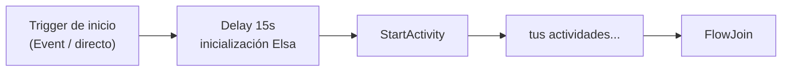
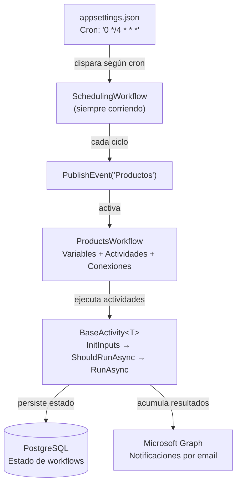

---
tags:
  - Arquitectura
  - Elsa
  - Workflows
---

# 02 — El motor de workflows: Elsa

## ¿Qué es Elsa?

**Elsa** es un motor de workflows open-source para .NET. Un motor de workflows es un sistema que permite definir procesos de varios pasos, ejecutarlos, monitorizarlos y programarlos para que se lancen automáticamente.

En este proyecto se usa la versión **3.6.2** de Elsa, que corre sobre **.NET 10**.

Sin Elsa, el código de sincronización sería una serie de llamadas encadenadas en un `Program.cs` o un `BackgroundService`. Con Elsa, cada paso es una actividad independiente, el motor gestiona el estado de cada ejecución, y puedes ver desde una interfaz web qué ha pasado, cuándo y con qué resultado.

---

## Conceptos fundamentales de Elsa

Antes de entender cómo se usa en este proyecto, hay que conocer los cuatro conceptos básicos:

### 1. Activity (Actividad)
Una **actividad** es la unidad mínima de trabajo. Representa un único paso dentro de un proceso: "llama a esta API", "transforma estos datos", "escribe en Shopify". Cada actividad tiene:
- **Inputs**: datos que recibe para poder ejecutarse.
- **Outputs**: datos que produce al terminar.
- Una lógica de ejecución encapsulada.

### 2. Variable
Una **variable** es un contenedor de datos que existe durante toda la vida de una ejecución de workflow. Las actividades la usan para pasarse información entre ellas: una actividad escribe en la variable, la siguiente la lee.

### 3. Connection (Conexión)
Una **conexión** define el orden de ejecución: "cuando termine la actividad A, ejecuta la actividad B". Las conexiones forman el grafo del workflow.

### 4. Flowchart
Un **Flowchart** es la estructura raíz que contiene todas las actividades, variables y conexiones de un workflow. Es el "mapa" completo del proceso.

---

## Cómo se define un workflow en este proyecto

En lugar de usar directamente las clases de Elsa, este proyecto introduce una clase base propia: **`BaseWorkflow`** (definida en `ElsaShared`). Todos los workflows del proyecto heredan de ella.

### La clase `BaseWorkflow`

```csharp
public class ProductsWorkflow(IConfiguration configuration)
    : BaseWorkflow("Productos", "Carga de productos a Shopify",
        config: configuration.GetSection("Workflows:Products").Get<WorkflowConfig>())
```

Para definir un workflow, solo hay que implementar **tres métodos abstractos**:

#### `VariablesDefinitions` — ¿Qué datos voy a manejar?
Define las variables del workflow: los contenedores de datos intermedios entre actividades.

```csharp
public override Dictionary<string, Variable> VariablesDefinitions(IWorkflowBuilder builder)
{
    return new Dictionary<string, Variable>
    {
        ["productos"]        = builder.WithVariable<Box<IProduct>>(),
        ["productosCrear"]   = builder.WithVariable<Box<IProduct>>(),
        ["productosActualizar"] = builder.WithVariable<Box<IProduct>>(),
        // ...
    };
}
```

#### `ActivitiesDefinitions` — ¿Qué pasos tiene el proceso?
Define cada actividad del workflow, indicando qué variables usa como entrada y cuáles produce como salida.

```csharp
public override Dictionary<string, Activity> ActivitiesDefinitions(...)
{
    return new Dictionary<string, Activity>
    {
        ["extraccionProductos"] = new ProductsWithImagesExtract
        {
            ProductsOutput = new(variables["productos"]),  // ← esta actividad escribe en "productos"
        },
        ["decisionProductos"] = new ProductsRebuildDecision
        {
            ProductosInput = new(variables["productos"]),  // ← esta actividad lee "productos"
            ProductosCrear = new(variables["productosCrear"]),  // ← y escribe en "productosCrear"
            // ...
        },
    };
}
```

#### `ConnectionsDefinitions` — ¿En qué orden se ejecutan?
Define las conexiones entre actividades.

```csharp
public override ICollection<Connection> ConnectionsDefinitions(...)
{
    return new List<Connection>
    {
        new(activities["extraccionProductos"], activities["decisionProductos"]),
        new(activities["decisionProductos"], activities["transformarCrearProductos"]),
        new(activities["decisionProductos"], activities["transformarActualizarProductos"]),
        // ...
    };
}
```

### Lo que `BaseWorkflow` añade automáticamente

Cuando defines esos tres métodos, `BaseWorkflow` construye el workflow completo por ti. Entre otras cosas, añade automáticamente al principio del grafo:



- **Trigger de inicio**: en producción es un `Event` (recibe la señal del planificador); en debug es directo.
- **Delay de 15 segundos**: da tiempo al motor de Elsa a terminar de inicializar antes de que empiecen a correr las actividades.
- **StartActivity**: punto de sincronización para ejecuciones paralelas.

También configura todas las actividades para ejecutarse **de forma asíncrona** y añade un `FlowJoin` como nodo de convergencia.

---

## `Box<T>`: el contenedor de colecciones

En las variables del workflow verás constantemente el tipo `Box<T>`:

```csharp
["productos"] = builder.WithVariable<Box<IProduct>>()
```

`Box<T>` es una clase simple definida en `ElsaShared`:

```csharp
public class Box<T>
{
    public ICollection<T> Property { get; set; } = null!;
}
```

Existe por una razón técnica: Elsa serializa el estado de las variables a JSON para guardarlo en la base de datos. Las colecciones genéricas como `List<IProduct>` (con una interfaz como tipo) dan problemas al deserializarse porque JSON no sabe qué tipo concreto instanciar. Envolver la lista en una clase concreta (`Box<T>`) resuelve el problema de serialización.

---

## Cómo se define una actividad en este proyecto

De forma análoga a los workflows, este proyecto usa una clase base propia para las actividades: **`BaseActivity<T>`** (en `ElsaShared`).

### La clase `BaseActivity<T>`

```csharp
public class StockExtract : BaseActivity<StockExtract>
{
    [Output] public required Output<Box<Stock>> Output { get; init; }

    protected override void InitInputs(ActivityExecutionContext context) { }

    protected override bool ShouldRunAsync() => true;

    protected override async Task<ActivityResult> RunAsync(ActivityExecutionContext context)
    {
        var provallianceService = context.GetRequiredService<ProvallianceService>();
        var response = await provallianceService.GetStock();
        Output.Set(context, response);
        return new ActivityResult { InformationLogs = [ $"Recuperados {response.Count} registros." ] };
    }
}
```

Para implementar una actividad, hay que definir **tres métodos**:

| Método | Para qué sirve |
|---|---|
| `InitInputs` | Lee las variables de entrada y las guarda en campos privados |
| `ShouldRunAsync` | Decide si la actividad debe ejecutarse (puede devolver `false` si no hay datos) |
| `RunAsync` | La lógica real de la actividad |

### Lo que `BaseActivity<T>` añade automáticamente

Antes y después de llamar a `RunAsync`, `BaseActivity<T>` gestiona automáticamente:

- **Logger y configuración**: inyectados y disponibles como `_logger` y `_configuration`.
- **Cronómetro**: mide cuánto tarda la actividad y lo añade a los logs.
- **Logs de inicio/fin**: imprime en los logs cuándo empieza y termina cada actividad, incluyendo si es incremental o completa.
- **Última ejecución exitosa**: consulta la base de datos y expone `LastWorkflowSuccessfulRun`, útil para las sincronizaciones incrementales.
- **Cancelación**: comprueba si el workflow está siendo cancelado y aborta limpiamente si es así.
- **Freno de emergencia** (`BrakeGuard`): un mecanismo para parar todos los workflows en caso de necesidad.
- **Recolección de notificaciones**: acumula los resultados de cada actividad para enviarlos por email al final.
- **Gestión de errores**: captura excepciones no controladas, las loguea y cancela la actividad sin romper el proceso completo.

---

## El sistema de planificación: `SchedulingWorkflow`

Los workflows no se disparan directamente por un cron. Hay un workflow especial llamado `SchedulingWorkflow` que actúa como planificador central.

### Cómo funciona

```text
SchedulingWorkflow
  ├── Cron("0 */4 * * *")  →  PublishEvent("Productos", payload: false)
  ├── Cron("0 * * * *")    →  PublishEvent("Productos", payload: true)   ← incremental
  ├── Cron("0 6 * * *")    →  PublishEvent("Stock", payload: false)
  └── ...
```

1. `SchedulingWorkflow` tiene múltiples actividades `Cron`, una por cada workflow que esté configurado con una expresión cron en `appsettings.json`.
2. Cuando llega el momento, el `Cron` dispara un `PublishEvent` con el nombre del workflow como identificador del evento.
3. El workflow correspondiente está escuchando ese evento (`Event(config.Name!)`) y se activa al recibirlo.
4. El payload del evento indica si es una ejecución completa (`false`) o incremental (`true`).

Si en `appsettings.json` el campo `Cron` de un workflow está a `null`, ese workflow no se programa automáticamente y solo puede lanzarse de forma manual desde Elsa Studio.

---

## El ciclo de vida de una ejecución

```text
1. TRIGGER
   └── Evento recibido (desde SchedulingWorkflow) o lanzamiento manual

2. INICIO
   └── Delay(15s) + StartActivity

3. EJECUCIÓN DE ACTIVIDADES
   └── Cada actividad se ejecuta en orden según las conexiones
       · InitInputs → ShouldRunAsync → RunAsync
       · Los resultados se escriben en las variables del workflow

4. FINALIZACIÓN
   └── El workflow llega al final del grafo y termina con estado "Finished"
   └── Se envían notificaciones por email si hay destinatarios configurados

5. LIMPIEZA (tras 30 días)
   └── El servicio de retención elimina automáticamente las instancias finalizadas
```

---

## La base de datos de Elsa

Elsa usa **PostgreSQL** (via Entity Framework Core) para persistir el estado de cada ejecución. Esto significa que si el servidor se reinicia mientras un workflow está corriendo, Elsa puede retomarlo desde donde lo dejó.

Hay dos bases de datos en el sistema:

| Base de datos | Para qué sirve |
|---|---|
| `elsa-provalliance` | Estado de los workflows: instancias, definiciones, bookmarks |
| `transactions-provalliance` | Transacciones propias del proyecto (control de sincronizaciones) |

---

## Resumen visual



---

## Siguiente paso

Con la arquitectura ETL y el motor Elsa ya claros, el siguiente documento entra en detalle en cada uno de los 6 workflows: qué hace cada uno, qué sistemas conecta y cómo fluyen los datos.

→ [03 — Los workflows del sistema](03-workflows-detalle.md)
