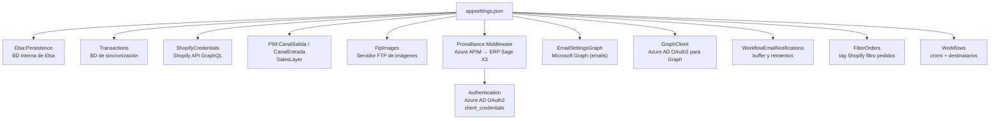

---
tags:
  - Configuración
  - ERP
  - Shopify
  - Elsa
---

# 08 — Configuración del sistema

Toda la configuración del sistema vive en `ElsaServer/appsettings.json` y sus variantes por entorno (`appsettings.Development.json`, `appsettings.Production.SalonSpace.json`). ASP.NET Core fusiona estos ficheros en tiempo de arranque: el base pone los defaults, cada variante de entorno sobreescribe solo lo que cambia.

Las variables de entorno del contenedor también pueden sobreescribir cualquier valor usando la notación `Seccion__SubSeccion__Campo` (doble guion bajo = separador jerárquico).

---

## Índice

1. [Elsa — motor de workflows](#1-elsa-motor-de-workflows)
2. [Transactions — BD de sincronización](#2-transactions-bd-de-sincronizacion)
3. [ShopifyCredentials — acceso a la tienda](#3-shopifycredentials-acceso-a-la-tienda)
4. [PIM — SalesLayer](#4-pim-saleslayer)
5. [FtpImages — servidor de imágenes](#5-ftpimages-servidor-de-imagenes)
6. [Provalliance — ERP middleware](#6-provalliance-erp-middleware)
7. [Email y notificaciones](#7-email-y-notificaciones)
8. [FilterOrders — filtro de pedidos](#8-filterorders-filtro-de-pedidos)
9. [Workflows — programación y alertas](#9-workflows-programacion-y-alertas)

---

## 1. Elsa — motor de workflows

```json
"Elsa": {
  "Persistence": {
    "ConnectionString": "Host=localhost;Port=36220;Database=elsa-provalliance;...",
    "DatabaseProvider": "PostgreSql"
  },
  "Identity": {
    "SigningKey": "sufficiently-large-secret-signing-key",
    "Roles": [
      { "Name": "admin", "Permissions": [ "*" ] }
    ],
    "Users": [
      { "Name": "admin", "Password": "password", "Roles": [ "admin" ] }
    ],
    "Applications": [
      {
        "Id": "",
        "Name": "",
        "Roles": [ "admin" ],
        "ClientId": "",
        "HashedApiKey": "",
        "HashedApiKeySalt": "",
        "HashedClientSecret": "",
        "HashedClientSecretSalt": ""
      }
    ]
  }
}
```

### 1.1 `Persistence` — dónde guarda Elsa su estado

Elsa necesita persistir todo lo que ocurre en los workflows: las definiciones, las instancias en ejecución, el historial, las variables, los triggers programados. Por defecto usa SQLite en memoria, pero en producción se configura PostgreSQL.

**`ConnectionString`:** cadena de conexión estándar de Npgsql (el driver de PostgreSQL para .NET).

```
Host=<IP_SERVIDOR>;           ← IP o nombre del servidor PostgreSQL
Port=5432;                ← puerto (5432 es el default)
Database=elsa;            ← nombre de la BD lógica
Username=postgres;        ← usuario
Password=<DB_PASSWORD>;   ← contraseña
Timeout=1024;             ← timeout de conexión en segundos
CommandTimeout=1024;      ← timeout de comandos SQL en segundos
MaxPoolSize=30;           ← máximo de conexiones simultáneas en el pool
```

Los `Timeout` y `CommandTimeout` altísimos (1024 segundos) son deliberados: algunas operaciones de sincronización masiva pueden tardar mucho y no deben abortarse por timeout.

`MaxPoolSize=30` limita las conexiones concurrentes al servidor de BD. Importante en producción para no saturar PostgreSQL cuando varios workflows corren en paralelo.

**`DatabaseProvider`:** siempre `"PostgreSql"`. Le dice a Elsa qué provider de Entity Framework usar internamente para sus propias tablas (historial de ejecución, definiciones de workflow, variables, etc.).

> En el `docker-compose.yml` de desarrollo, esta cadena de conexión se sobreescribe mediante variable de entorno `Elsa__Persistence__ConnectionString`, apuntando al contenedor `pataky-postgres` de Docker.

---

### 1.2 `Identity` — quién puede acceder a la API de Elsa

La API de Elsa está protegida. Cualquier llamada sin autenticar (incluyendo las del Elsa Studio) recibe un 401. El sistema de identidad tiene tres conceptos:

#### `SigningKey` — la llave de firma de los JWT

```json
"SigningKey": "<ELSA_SIGNING_KEY>"
```

Elsa usa **JWT (JSON Web Tokens)** para la autenticación. Cuando un usuario hace login, Elsa genera un JWT firmado con esta llave. Cada petición posterior incluye ese JWT, y Elsa verifica la firma usando la misma llave.

Requisitos de la llave:
- Mínimo **256 bits** (32 bytes). En base64 o ASCII eso son al menos 32 caracteres.
- Debe ser un secreto: si alguien la conoce, puede generar tokens válidos sin pasar por el login.
- En el `appsettings.json` base está como `"sufficiently-large-secret-signing-key"` (placeholder), que se sobreescribe en producción con una clave real larga y aleatoria.
- En el `docker-compose.yml` de desarrollo, esta llave también puede inyectarse como variable de entorno: `Elsa__Identity__SigningKey`.

#### `Roles` — qué permisos tiene cada rol

```json
"Roles": [
  { "Name": "admin", "Permissions": [ "*" ] }
]
```

Solo existe el rol `"admin"` con permisos `"*"` (todo). No hay distinción de roles granulares — o tienes acceso completo o no tienes acceso. Los permisos se implementan internamente en Elsa como strings que identifican operaciones específicas de la API, pero con `"*"` se acepta todo.

El rol `"admin"` se carga desde esta configuración por `ConfigurationBasedRoleProvider` (clase en `AutenticacionAutorizacion.cs`). Cada rol usa su propio `Name` como `Id` (en lugar de un GUID generado), para que la configuración sea determinista entre reinicios.

#### `Users` — usuarios que pueden hacer login con usuario/contraseña

```json
"Users": [
  { "Name": "admin", "Password": "password", "Roles": [ "admin" ] }
]
```

En desarrollo hay un usuario `admin` / `password`. En producción está sobreescrito con credenciales reales (`provalliance` / `<ELSA_ADMIN_PASSWORD>`).

El flujo de autenticación de un usuario:
1. El Elsa Studio hace `POST /elsa/api/identity/login` con `{ username, password }`.
2. Elsa verifica la contraseña usando **PBKDF2-SHA256** con 10.000 iteraciones (implementado en `CustomSecretHasher`).
3. Si es correcta, devuelve un JWT firmado con la `SigningKey`.
4. El Studio incluye ese JWT en la cabecera `Authorization: Bearer {token}` de todas las peticiones.

#### `Applications` — clientes de API que se autentican con API Key o Client Secret

```json
"Applications": [
  {
    "Id": "",
    "Name": "",
    "Roles": [ "admin" ],
    "ClientId": "",
    "HashedApiKey": "",
    "HashedApiKeySalt": "",
    "HashedClientSecret": "",
    "HashedClientSecretSalt": ""
  }
]
```

Permite registrar aplicaciones externas (no usuarios) que acceden a la API de Elsa. Una aplicación puede autenticarse con:
- **API Key**: clave estática incluida en la cabecera `x-api-key`.
- **Client Secret**: flujo OAuth2 con `client_id` y `client_secret`.

Los valores están hasheados con PBKDF2 (igual que las contraseñas de usuario) para que no queden en texto plano. En la configuración actual están todos vacíos — no se usan aplicaciones externas.

---

## 2. Transactions — BD de sincronización

```json
"Transactions": {
  "ConnectionString": "Host=localhost;Port=36220;Database=transactions-provalliance;..."
}
```

La cadena de conexión a la segunda base de datos: `transactions-provalliance`. Esta BD la gestiona Entity Framework Core a través de `TransactionsService` y contiene todos los pares `OriginId ↔ DestinoId` (ver apartado 06 para la estructura completa de las tablas).

El formato es idéntico al de `Elsa:Persistence:ConnectionString`. En producción también lleva `MaxPoolSize=30`.

No hay más configuración para esta BD — no tiene usuarios propios ni roles. Usa las mismas credenciales que la BD de Elsa porque comparten el mismo servidor PostgreSQL.

---

## 3. ShopifyCredentials — acceso a la tienda

```json
"ShopifyCredentials": {
  "ShopDomain":        "https://<TIENDA>.myshopify.com",
  "AccessTokens":      [ "<SHOPIFY_ACCESS_TOKEN>" ],
  "LocationId":        "gid://shopify/Location/68298375246",
  "PublicationId":     "gid://shopify/Publication/111380496462",
  "DefaultPriceListId":"gid://shopify/PriceList/18238865486",
  "LeadPrefix":        "LEAD#",
  "AgentTags":         ["agente"]
}
```

### 3.1 `ShopDomain` — la tienda

La URL completa del dominio de Shopify en formato `https://{nombre}.myshopify.com`. Todas las llamadas a la API GraphQL de Shopify se dirigen a `{ShopDomain}/api/2024-10/graphql.json` (o la versión de API configurada).

Nunca usar el dominio personalizado (ej: `www.provalliance.com`) — siempre el dominio `.myshopify.com` interno.

---

### 3.2 `AccessTokens` — tokens de autenticación y rate limiting

```json
"AccessTokens": [
  "<SHOPIFY_ACCESS_TOKEN>"
]
```

Son los **Custom App Access Tokens** de Shopify. Cada token se genera en el panel de administración de Shopify al crear una "Custom App" y tiene los permisos que se le asignaron al crearla (lectura/escritura de productos, inventario, clientes, pedidos, etc.).

**Por qué puede haber más de uno — el LeakyBucket:**

Shopify tiene un sistema de rate limiting llamado **Leaky Bucket** para su API GraphQL. Cada tienda tiene un bucket con capacidad de 1.000 puntos de coste. Cada query GraphQL consume un número de puntos según su complejidad. El bucket se recarga a 50 puntos/segundo.

El SDK de Shopify del proyecto usa `LeakyBucketExecutionPolicy`: antes de enviar cada request, comprueba cuántos puntos quedan y espera si es necesario.

Cuando se tienen **múltiples tokens** (de múltiples Custom Apps registradas en la misma tienda), cada token tiene su propio bucket independiente. El SDK puede alternar entre tokens para multiplicar la capacidad efectiva:

```
Token A: 1.000 puntos → si se agota, pasa al Token B
Token B: 1.000 puntos → si se agota, pasa al Token C
                         (mientras A se recarga)
```

En la configuración actual de producción solo hay un token. Si el sistema necesitara más throughput, se añadirían más tokens aquí.

---

### 3.3 `LocationId` — la ubicación de inventario

```json
"LocationId": "gid://shopify/Location/68298375246"
```

Shopify gestiona el inventario por ubicación física (almacén, tienda, etc.). Cada ajuste de stock debe especificar en qué `Location` se modifica el inventario.

Este campo guarda el GID de la **única ubicación** que usa el sistema. Se obtiene desde el panel de Shopify:
- Ajustes → Sucursales → clic en la sucursal → copiar el ID numérico de la URL → construir el GID: `gid://shopify/Location/{ID}`.

`StockTransform` incluye este `LocationId` en cada `VariantStockUpdate` para que el loader sepa dónde actualizar el inventario.

---

### 3.4 `PublicationId` — el canal de venta

```json
"PublicationId": "gid://shopify/Publication/111380496462"
```

En Shopify B2B, los productos no son visibles por defecto en todos los canales de venta. Se "publican" en una `Publication` específica. Este ID identifica en qué canal de venta deben publicarse los productos al crearlos.

Para obtenerlo hay que hacer una query GraphQL desde el explorador GraphiQL de la tienda:

```graphql
{ publications(first: 10) { edges { node { id name } } } }
```

Los productos nuevos se asocian automáticamente a esta publicación durante el proceso de creación (si `ExcludeNewProductsFromMarkets` es `false`) o se excluyen y se añaden manualmente.

---

### 3.5 `DefaultPriceListId` — la tarifa por defecto

```json
"DefaultPriceListId": "gid://shopify/PriceList/18238865486"
```

En Shopify B2B, las `CompanyLocation` deben tener una tarifa asignada para que los clientes de esa sucursal puedan ver precios. Cuando se crea una nueva location en el workflow de clientes, se le asigna esta tarifa por defecto hasta que el workflow de tarifas asigne la correcta.

Es el "precio de catálogo" estándar — el que ve un cliente que aún no tiene tarifa específica negociada.

---

### 3.6 `LeadPrefix` — prefijo de leads

```json
"LeadPrefix": "LEAD#"
```

Algunos pedidos de Shopify son "leads" (solicitudes de presupuesto, no pedidos reales). Se identifican porque su número de pedido empieza con este prefijo. El workflow de pedidos los filtra y no los envía al ERP.

---

### 3.7 `AgentTags` — etiquetas de agentes comerciales

```json
"AgentTags": ["agente"]
```

Los clientes de Shopify que son agentes comerciales internos (no clientes finales) tienen este tag asignado. El sistema los trata de forma especial: se crean en Shopify pero con el flag `IsAgent = true` en la BD de transacciones.

---

## 4. PIM — SalesLayer

```json
"PIM": {
  "CanalEntrada": {
    "ChannelId": "CN36742H1755C11143",
    "APIKey":    "<SALESLAYER_API_KEY_ENTRADA>",
    "version":   "1.17"
  },
  "CanalSalida": {
    "ChannelId": "CN36672H5814C11143",
    "APIKey":    "<SALESLAYER_API_KEY_SALIDA>",
    "version":   "1.17"
  }
}
```

SalesLayer tiene una arquitectura de **canales** (channels). Cada canal es una vista o configuración del catálogo independiente, con sus propios permisos de lectura/escritura y sus propias API Keys.

El sistema usa **dos canales distintos** para dos propósitos opuestos:

### 4.1 `CanalSalida` — lectura del catálogo (Extractor)

El canal de salida es el que el sistema **lee** para obtener los productos. El `ProductsExtractor` hace peticiones a la API de SalesLayer usando este canal para descargar todos los `SalonSpaceProduct` con sus campos (nombre, EAN, imágenes, precios, metafields...).

"Salida" desde la perspectiva de SalesLayer: los datos salen del PIM hacia el exterior (hacia este sistema).

**Autenticación:** API Key en la cabecera de la petición. La estructura de la URL es aproximadamente:
```
GET https://api.saleslayer.com/...?channel_token={ChannelId}&api_key={APIKey}&version={version}
```

**`version`:** la versión del API de SalesLayer. `"1.17"` es la versión del contrato de la respuesta JSON que el sistema espera. Si SalesLayer actualiza su API, cambiar esta versión puede cambiar la estructura de la respuesta y romper la deserialización.

### 4.2 `CanalEntrada` — escritura de imágenes (Loader)

El canal de entrada es el que el sistema **escribe** para enviar datos al PIM. Actualmente solo se usa en el workflow `ImagesToPIM`: el sistema carga imágenes desde el servidor FTP y las registra en SalesLayer a través de este canal.

"Entrada" desde la perspectiva de SalesLayer: los datos entran al PIM desde el exterior.

La separación en dos canales tiene ventajas:
- **Seguridad**: el canal de solo lectura (`CanalSalida`) no puede escribir accidentalmente en el PIM aunque la API Key se filtre.
- **Auditoría**: SalesLayer puede registrar qué modificaciones vinieron de qué canal.
- **Configuración independiente**: el canal de entrada puede tener campos limitados (solo los necesarios para imágenes), mientras el de salida tiene acceso completo de lectura.

---

## 5. FtpImages — servidor de imágenes

```json
"FtpImages": {
  "Host":               "ftp.rutilliadolfo.com",
  "Port":               21,
  "Username":           "TheHairPro",
  "Password":           "<FTP_PASSWORD>",
  "RemoteFolders":      [ "/smartie/sync_erp/images/import/new" ],
  "UsePassive":         true,
  "FileNameStartsWith": []
}
```

Configuración del servidor FTP desde el que el workflow `ImagesToPIM` descarga los ficheros de imagen para subirlos al PIM.

| Campo | Descripción |
|---|---|
| `Host` | Hostname o IP del servidor FTP |
| `Port` | Puerto FTP. El 21 es el estándar |
| `Username` / `Password` | Credenciales de acceso |
| `RemoteFolders` | Lista de carpetas del FTP a escanear. El extractor descarga todos los ficheros de cada carpeta |
| `UsePassive` | Modo pasivo FTP. Con `true`, el servidor FTP abre el puerto de datos — necesario cuando el cliente está detrás de NAT o firewall |
| `FileNameStartsWith` | Lista de prefijos para filtrar ficheros. Si está vacío, descarga todos |

---

## 6. Provalliance — ERP middleware

```json
"Provalliance": {
  "Middleware": {
    "BaseUrl": "https://apim-prod-hint-provalliance.azure-api.net",
    "Authentication": {
      "Url":          "https://login.microsoftonline.com/{tenantId}/oauth2/token",
      "ClientId":     "<AZURE_CLIENT_ID>",
      "ClientSecret": "<AZURE_CLIENT_SECRET>",
      "Resource":     "api://ba2bedaa-0dc2-4382-a1e5-77a801e2a775",
      "Scope":        ".default"
    },
    "SubscriptionKey": "<SUBSCRIPTION_KEY>"
  }
}
```

Esta sección configura el acceso al ERP Provalliance (Sage X3). El ERP no está expuesto directamente a internet — está detrás de **Azure API Management (APIM)**, que actúa como proxy y gateway de seguridad. Acceder al ERP requiere dos capas de autenticación:

### 6.1 `BaseUrl` — el endpoint de Azure API Management

```
https://apim-prod-hint-provalliance.azure-api.net
```

Todas las llamadas al ERP van a este endpoint de APIM, no directamente al servidor ERP. APIM enruta la petición internamente al ERP real.

La URL tiene el prefijo `apim-prod-hint-` que indica: Azure API Management (`apim`), entorno de producción (`prod`), cliente Hint (`hint`), proyecto Provalliance.

---

### 6.2 `Authentication` — OAuth2 Client Credentials (Azure AD)

El acceso al APIM requiere un **token de acceso OAuth2** de Azure Active Directory. El flujo es `client_credentials` (máquina a máquina, sin intervención del usuario):

```
1. El sistema → Azure AD:
   POST https://login.microsoftonline.com/{tenantId}/oauth2/token
   Body: {
     grant_type:    "client_credentials",
     client_id:     "adde8fc4-...",
     client_secret: "RJe8Q~huIA...",
     resource:      "api://ba2bedaa-...",
     scope:         ".default"
   }

2. Azure AD → El sistema:
   { "access_token": "eyJ0eXAiOiJKV1Q...", "expires_in": 3600 }

3. El sistema → APIM:
   GET https://apim-prod-hint-provalliance.azure-api.net/customers
   Headers: {
     Authorization: "Bearer eyJ0eXAiOiJKV1Q...",
     Ocp-Apim-Subscription-Key: "<APIM_SUBSCRIPTION_KEY>"
   }
```

**Campos:**

| Campo | Descripción |
|---|---|
| `Url` | Endpoint de token de Azure AD. El `{tenantId}` es el ID del directorio de Azure de Provalliance (`81b27477-db1f-49f0-8aa5-3d60b9db5700`) |
| `ClientId` | ID de la aplicación registrada en Azure AD que representa este sistema de integración |
| `ClientSecret` | El secreto/contraseña de esa aplicación. Se genera en el portal de Azure y caduca periódicamente |
| `Resource` | La audiencia del token: identifica la API protegida a la que se quiere acceder. Es el App ID URI de la aplicación APIM registrada en Azure AD |
| `Scope` | `.default` solicita todos los permisos que la aplicación tiene ya configurados en Azure AD (sin especificar scopes adicionales) |

El token devuelto por Azure AD es un JWT que APIM valida internamente para comprobar que el llamante está autorizado.

**Caducidad del token:** Azure AD devuelve tokens que duran 1 hora (`expires_in: 3600`). El extractor de Provalliance debe renovar el token cuando caduca. El mecanismo de caché y renovación está implementado en el extractor.

---

### 6.3 `SubscriptionKey` — la segunda capa de autenticación de APIM

```json
"SubscriptionKey": "<APIM_SUBSCRIPTION_KEY>"
```

Azure API Management tiene dos mecanismos de autenticación independientes:

1. **OAuth2** (el Bearer token que hemos visto) — valida la identidad de la aplicación.
2. **Subscription Key** — valida que la aplicación está suscrita a ese producto de API concreto.

La clave de suscripción va en la cabecera `Ocp-Apim-Subscription-Key` de cada petición. APIM rechaza la petición si falta o es incorrecta, incluso si el Bearer token es válido.

Esta doble autenticación es una práctica habitual en Azure API Management para tener un control granular: puedes revocar el acceso de una aplicación rápidamente revocando su suscripción (la clave), sin tocar la configuración de Azure AD.

---

## 7. Email y notificaciones

### `EmailSettingsGraph`

```json
"EmailSettingsGraph": {
  "AuthType":      "APPLICATION_PERMISSIONS",
  "SenderId":      "dotnet@upango.es",
  "SaveToSentItems": false
}
```

| Campo | Descripción |
|---|---|
| `AuthType` | `APPLICATION_PERMISSIONS` usa un token de app (sin usuario). `USERNAME_PASSWORD` usa credenciales de usuario |
| `SenderId` | Email desde el que se envían las notificaciones |
| `SaveToSentItems` | Si guardar los emails enviados en la carpeta "Enviados" del buzón |

### `GraphClient`

```json
"GraphClient": {
  "ApiVersion": "v1.0",
  "Tenant":     "92b3ae0b-...",
  "ClientId":   "aace368c-...",
  "ApplicationPermissions": {
    "ClientSecret":      "<GRAPH_CLIENT_SECRET>",
    "CertificateName":   ""
  },
  "UsernamePassword": { "Username": "", "Password": "" },
  "Organization": ""
}
```

Configuración del cliente de **Microsoft Graph API** para enviar emails. Graph API es el API de Microsoft 365 que, entre otras cosas, permite enviar emails a través de Exchange Online.

Usa el mismo flujo OAuth2 `client_credentials` que el ERP, pero en este caso la "resource" es `https://graph.microsoft.com/.default`. El `Tenant`, `ClientId` y `ClientSecret` son de una aplicación distinta registrada en el Azure AD de Upango (no el de Provalliance).

### `WorkflowEmailNotifications`

```json
"WorkflowEmailNotifications": {
  "SubjectPrefix":          "Provalliance",
  "MaxRetryAttempts":       5,
  "RetryBaseDelaySeconds":  15,
  "BufferRetentionMinutes": 120
}
```

| Campo | Descripción |
|---|---|
| `SubjectPrefix` | Prefijo del asunto del email. Aparece como `"[Provalliance] Error en workflow Productos"` |
| `MaxRetryAttempts` | Si el envío del email falla (ej: Graph API no disponible), reintenta hasta 5 veces |
| `RetryBaseDelaySeconds` | Espera inicial entre reintentos en segundos. Con backoff exponencial: 15s, 30s, 60s... |
| `BufferRetentionMinutes` | Los emails se guardan en un buffer en memoria. Si llevan más de 120 minutos sin enviarse, se descartan |

---

## 8. FilterOrders — filtro de pedidos

```json
"FilterOrders": {
  "query": "tag_not:Sincronizado"
}
```

El workflow de pedidos usa esta query de Shopify para filtrar qué pedidos descarga. La query `tag_not:Sincronizado` devuelve solo los pedidos que **no tienen** el tag `Sincronizado`.

El flujo completo es:
1. El extractor descarga pedidos con `tag_not:Sincronizado`.
2. El loader los transforma y envía al ERP.
3. Si el envío es exitoso, el loader añade el tag `Sincronizado` al pedido en Shopify.
4. En la próxima ejecución, ese pedido ya no aparece en la query.

Esta estrategia de idempotencia es simple y robusta: si el sistema cae a mitad de proceso, los pedidos sin tag se vuelven a procesar en la siguiente ejecución. No se usa un timestamp de "última sincronización" porque eso podría perder pedidos si el reloj tiene deriva o si un pedido se modifica retroactivamente.

---

## 9. Workflows — programación y alertas

```json
"Workflows": {
  "Products": {
    "Name": "Productos",
    "Cron": "0 0 * * * *",
    "IncrementalCron": null,
    "Notifications": {
      "Recipients": [
        { "Email": "dotnet@upango.es", "MinSeverity": "Warning" }
      ]
    }
  },
  "Stock": {
    "Name": "Stock",
    "Cron": "0 */10 4-21 * * *",
    ...
  }
  // ... resto de workflows
}
```

Esta sección configura el comportamiento de cada uno de los 6 workflows del sistema.

---

### 9.1 `Name` — nombre identificativo

El nombre en texto plano del workflow. Se usa en los emails de notificación (`"Error en workflow Productos"`) y en los logs. No afecta a la ejecución.

---

### 9.2 `Cron` — cuándo se ejecuta el workflow

El cron usa el formato **6 campos** de Quartz.NET (no el estándar Unix de 5 campos):

```
┌──────────── segundo (0-59)
│  ┌───────── minuto (0-59)
│  │  ┌────── hora (0-23)
│  │  │  ┌─── día del mes (1-31)
│  │  │  │  ┌── mes (1-12)
│  │  │  │  │  ┌─ día de la semana (0-6, 0=domingo)
│  │  │  │  │  │
0  0  *  *  *  *
```

**Crons de producción explicados:**

| Workflow | Cron | Lectura humana |
|---|---|---|
| Productos | `0 0 * * * *` | En el segundo 0 del minuto 0 de cada hora → cada hora en punto (00:00, 01:00, 02:00...) |
| ImagesToPIM | `0 * * * * *` | En el segundo 0 de cada minuto → cada minuto |
| ImagesToShopify | `0 30 * * * *` | En el segundo 0 del minuto 30 de cada hora → cada hora y media (00:30, 01:30, 02:30...) |
| Stock | `0 */10 4-21 * * *` | En el segundo 0, cada 10 minutos, solo entre las 4:00 y las 21:59 |
| Clientes | `0 15 * * * *` | En el segundo 0 del minuto 15 de cada hora → 00:15, 01:15, 02:15... |
| Pedidos | `0 */5 * * * *` | En el segundo 0, cada 5 minutos, las 24 horas |

**El cron de Stock analizado:** `0 */10 4-21 * * *`

- `0` → en el segundo 0 (inicio del minuto)
- `*/10` → cada 10 minutos (0, 10, 20, 30, 40, 50)
- `4-21` → solo en las horas entre las 4 y las 21 (4:00, 4:10, ..., 21:50)
- `* * *` → cualquier día, mes y día de la semana

El ERP actualiza el stock cada 10 minutos en el rango 6:04-21:44. El cron es más amplio (4:00-21:59) para garantizar cobertura cuando cambia la hora oficial (horario de verano/invierno). La sincronización fuera del horario del ERP simplemente no encontrará cambios y terminará rápido.

**Si `Cron` es `null`:** el workflow solo se puede lanzar manualmente desde Elsa Studio o mediante la API. Es la configuración en desarrollo y para workflows que aún no están en producción.

---

### 9.3 `IncrementalCron` — sincronización incremental

```json
"IncrementalCron": null
```

Actualmente `null` en todos los workflows. Está pensado para una futura implementación de **sincronizaciones incrementales**: en lugar de procesar todos los registros del ERP en cada ejecución, solo procesar los que han cambiado desde la última sincronización.

Por ejemplo, `"Cron": "0 0 * * * *"` (completo cada hora) + `"IncrementalCron": "0 */5 * * * *"` (incremental cada 5 minutos) permitiría sincronizaciones frecuentes con bajo coste.

---

### 9.4 `Notifications.Recipients` — a quién se notifica y con qué nivel

```json
"Notifications": {
  "Recipients": [
    { "Email": "dotnet@upango.es", "MinSeverity": "Warning" }
  ]
}
```

Cada workflow puede tener su propia lista de destinatarios de email. Cuando un workflow termina, se envía un email a cada destinatario cuyo `MinSeverity` sea igual o menor que la severidad real del resultado.

**`MinSeverity`** puede ser:
- `"Information"` → recibe email siempre (tanto si todo fue bien como si hubo errores).
- `"Warning"` → recibe email solo si hubo al menos un warning o un error.
- `"Error"` → recibe email solo si hubo al menos un error.
- `"Critical"` → recibe email solo en errores críticos (fallos que interrumpieron el workflow).

En producción todos los workflows tienen `"MinSeverity": "Warning"`, lo que significa que el equipo técnico recibe un email cada vez que hay algo que investigar, pero no recibe notificaciones de ejecuciones limpias.

Si `Recipients` está vacío `[]`, no se envía ningún email al terminar el workflow.

---

## Resumen: relación entre configuración y arquitectura



---

## Siguiente paso

→ [`09-elsa-studio.md`](09-elsa-studio.md) — La interfaz visual de Elsa Studio

---

## Documentos relacionados

| Documento | Relación |
|---|---|
| [07 — Infraestructura](07-infraestructura.md) | Los contenedores que leen estas variables de entorno |
| [02 — El motor Elsa](02-elsa-workflows.md) | Sección `Elsa:Persistence` y `SchedulingWorkflow` con los crons |
| [04 — Extractors](04-extractors.md) | Usan `ShopifyCredentials`, `PIM` y `Provalliance` de la configuración |
| [09 — Elsa Studio](09-elsa-studio.md) | Lee `Elsa:Identity` para autenticación de la interfaz visual |
