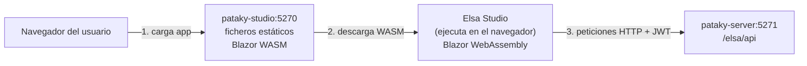

---
tags:
  - Elsa
  - Studio
  - Workflows
---

# 09 — Elsa Studio: la interfaz visual

Elsa Studio es la interfaz web que permite observar, controlar y depurar el sistema de sincronización sin tocar el código. Desde ella puedes ver qué workflows están definidos, cuándo se han ejecutado, qué pasó en cada paso y lanzar ejecuciones manualmente.

---

## Índice

1. [Qué es Elsa Studio y cómo funciona por dentro](#1-que-es-elsa-studio-y-como-funciona-por-dentro)
2. [Acceso y autenticación](#2-acceso-y-autenticacion)
3. [Las secciones de la interfaz](#3-las-secciones-de-la-interfaz)
4. [Cómo lanzar un workflow manualmente](#4-como-lanzar-un-workflow-manualmente)
5. [Cómo depurar una ejecución fallida](#5-como-depurar-una-ejecucion-fallida)
6. [La API personalizada del servidor](#6-la-api-personalizada-del-servidor)
7. [El freno de emergencia](#7-el-freno-de-emergencia)

---

## 1. Qué es Elsa Studio y cómo funciona por dentro

Elsa Studio es una aplicación **Blazor WebAssembly** — todo el código se ejecuta en el **navegador del usuario**, no en el servidor. El servidor solo sirve los ficheros estáticos (HTML, CSS, JavaScript compilado). Una vez cargada en el navegador, la aplicación hace llamadas directamente a la API del servidor Elsa (`pataky-server`).



Por eso la variable `ElsaServerUrl` debe ser una dirección accesible desde la máquina del usuario (no desde dentro de la red Docker). Si el usuario abre el navegador en su portátil y el servidor está en una IP `<IP_SERVIDOR>`, la URL debe ser `http://<IP_SERVIDOR>:5271/elsa/api`.

### Los dos proyectos de Studio

El Studio está dividido en dos proyectos .NET que trabajan juntos:

**`ElsaStudio.WebAssembly`** — la aplicación Blazor WebAssembly en sí. Contiene toda la UI, los módulos de Elsa, la lógica de login y la comunicación con la API. Se compila a WebAssembly y se sirve como ficheros estáticos.

Módulos registrados en su `Program.cs`:
- `AddCore()` — servicios base de Elsa Studio
- `AddShell()` — el shell (estructura de la página, navegación lateral)
- `AddRemoteBackend()` — cliente HTTP hacia la API de Elsa, con autenticación JWT automática
- `AddLoginModule()` + `UseElsaIdentity()` — pantalla de login y gestión del token JWT
- `AddDashboardModule()` — la pantalla de inicio con métricas
- `AddWorkflowsModule()` — la sección de workflows (definiciones, instancias, diseñador visual)
- `AddAgentsModule()` — módulo de agentes IA de Elsa (no usado activamente en este proyecto)

**`ElsaStudio.Web`** — el servidor ASP.NET Core que sirve los ficheros del WebAssembly. Su único trabajo es responder peticiones HTTP con los ficheros estáticos de la app. Cuando el navegador carga cualquier ruta (ej: `/workflows`), el servidor devuelve siempre el `index.html` del WebAssembly (`MapFallbackToPage("/_Host")`), y el enrutamiento lo gestiona Blazor en el cliente.

---

## 2. Acceso y autenticación

### URL de acceso

| Entorno | URL |
|---|---|
| Desarrollo local | `http://localhost:5270` |
| Producción | `http://<IP_SERVIDOR>:5270` |

### Credenciales

Las credenciales se configuran en `appsettings.json` bajo `Elsa:Identity:Users`:

| Entorno | Usuario | Contraseña |
|---|---|---|
| Desarrollo | `admin` | `password` |
| Producción (SalonSpace) | `provalliance` | `<ELSA_ADMIN_PASSWORD>` |

### El flujo de login

1. El navegador carga Elsa Studio y detecta que no hay JWT en la sesión.
2. Redirige a la pantalla de login.
3. Al enviar usuario y contraseña, Studio hace `POST /elsa/api/identity/login`.
4. El servidor verifica la contraseña con PBKDF2-SHA256 y devuelve un JWT firmado con la `SigningKey`.
5. Studio guarda el JWT en memoria (no en `localStorage`) y lo añade a la cabecera `Authorization: Bearer {token}` de todas las peticiones siguientes.
6. Cuando el token caduca, Studio redirige automáticamente a la pantalla de login.

---

## 3. Las secciones de la interfaz

### Dashboard

La pantalla de inicio. Muestra un resumen del estado del sistema:
- Número de workflows definidos
- Instancias recientes: cuántas han terminado correctamente, cuántas con error, cuántas están en ejecución ahora mismo
- Accesos rápidos a las secciones más usadas

### Workflows → Definiciones

Lista todos los workflows definidos en el código. Para cada uno muestra:
- Nombre y descripción
- Si está publicado (activo) o en borrador
- La versión actual
- Un botón para entrar al diseñador visual

**El diseñador visual** muestra el grafo del workflow como cajas (actividades) conectadas con flechas. Para este proyecto, los grafos son lineales (Extract → Transform → Load), aunque las actividades de decisión introducen ramas. Desde el diseñador puedes ver la configuración de cada actividad, pero **no debes modificar los workflows desde el Studio** en este proyecto — están definidos íntegramente en código C# y cualquier cambio desde la UI se perdería al reimportar el workflow.

### Workflows → Instancias

El historial de todas las ejecuciones. Cada ejecución de un workflow crea una **instancia**. La lista muestra:
- Nombre del workflow
- ID único de la instancia
- Fecha y hora de inicio y fin
- Estado: `Finished` (completado), `Faulted` (falló con error), `Running` (en curso), `Cancelled`

Puedes filtrar por workflow, por estado y por rango de fechas. Las instancias antiguas se eliminan automáticamente por la política de retención configurada en `Elsa.Retention`.

### Workflows → Scheduler

Muestra los triggers de tiempo registrados: qué workflows tienen cron activo y cuándo se ejecutarán la próxima vez. Útil para comprobar que los crons están bien configurados y activos.

---

## 4. Cómo lanzar un workflow manualmente

Desde Elsa Studio puedes lanzar cualquier workflow sin esperar al cron.

**Desde la sección Definiciones:**
1. Entrar en la lista de definiciones de workflows.
2. Buscar el workflow que quieres lanzar (ej: "Productos").
3. Hacer clic en el botón de ejecución (▶).
4. Confirmar el lanzamiento.
5. Elsa crea una nueva instancia y la ejecuta en segundo plano.

**Comportamiento importante:** lanzar manualmente un workflow no detiene ni interrumpe los que están en curso. Si el workflow de Productos está corriendo por el cron y lo lanzas manualmente también, habrá **dos instancias del mismo workflow corriendo en paralelo**. Esto puede causar conflictos si ambas instancias modifican las mismas entidades en Shopify. Para evitarlo, antes de lanzar manualmente comprueba que no hay una instancia en estado `Running` del mismo workflow.

**Alternativa vía API:** también puedes lanzar un workflow desde la API personalizada del servidor (ver sección 6):

```http
POST http://<IP_SERVIDOR>:5271/api/upango/workflows/execute
Authorization: Bearer {token}
Content-Type: application/json

{ "WorkflowName": "Productos" }
```

---

## 5. Cómo depurar una ejecución fallida

Cuando un workflow falla, aparece en la lista de instancias con estado `Faulted` (icono en rojo). El proceso de depuración tiene varios niveles de detalle:

### Nivel 1: el resumen de la instancia

Clic en la instancia fallida → muestra:
- En qué actividad falló (la actividad aparece marcada en rojo en el grafo).
- El mensaje de error de la excepción que causó el fallo.
- Cuánto tiempo tardó en fallar.

Esto sirve para localizar rápidamente **dónde** falló (en qué extractor, transformer o loader).

### Nivel 2: el journal de la instancia

El **journal** es el registro paso a paso de todo lo que hizo la instancia. Cada actividad tiene una entrada en el journal con:
- Nombre de la actividad
- Estado (Started, Completed, Faulted)
- Timestamp de inicio y fin
- Datos de entrada y salida de la actividad (las variables que tenía al entrar y al salir)

El journal es la herramienta más potente para entender **qué datos** procesó el workflow en esa ejecución concreta.

### Nivel 3: los logs de actividad

Además del journal de Elsa, cada actividad del proyecto usa `ActivityResult` para acumular mensajes de log durante su ejecución y escribirlos al final en un bloque formateado:

```
########## RESULTADO DE EJECUCIÓN DE LA ACTIVIDAD "StockLoader" ##########
#
#   Advertencias:
#      Variante con EAN 8432023456789 no encontrada en BD. Ignorando.
#      Variante con EAN 8432023456790 no encontrada en BD. Ignorando.
#   Errores:
#      Error actualizando stock de gid://shopify/ProductVariant/123: ...
#
##########################################################################
```

Estos bloques aparecen en los logs del servidor (`docker logs pataky-server`) y también en el journal de Elsa si el nivel de log es suficiente.

### Nivel 4: los logs del servidor

Para ver todos los logs de una ejecución completa, incluyendo logs de nivel `Debug` y `Trace` que el Studio no muestra:

```bash
# En el servidor (o desde el host con Docker)
docker logs pataky-server --since 2h 2>&1 | grep "RESULTADO"
```

O usando la API personalizada para exportar los logs de una instancia concreta (ver sección 6).

---

## 6. La API personalizada del servidor

Además de la API estándar de Elsa (`/elsa/api/...`), el proyecto expone su propia API en `/api/upango/workflows/...`. Esta API requiere autenticación JWT (el mismo token que usa el Studio).

Todos los endpoints aceptan el nombre del workflow (como "Productos") o el ID de definición de Elsa como parámetro.

---

### Workflows programados

**`GET /api/upango/workflows/scheduled`**

Devuelve la lista de todos los workflows que tienen cron configurado. Útil para verificar que el SchedulingWorkflow los tiene todos registrados.

```json
[
  { "workflowId": "Productos", "nextRunAt": "2026-06-18T01:00:00Z" },
  { "workflowId": "Stock",     "nextRunAt": "2026-06-18T00:10:00Z" }
]
```

---

**`GET /api/upango/workflows/scheduled/{workflowId}/cron`**

Devuelve el cron actual configurado para un workflow concreto.

**`PUT /api/upango/workflows/scheduled/{workflowId}/cron`**

Actualiza el cron de un workflow en caliente, sin reiniciar el servidor. Útil si necesitas desactivar temporalmente un workflow o cambiar su frecuencia sin tocar el `appsettings.json`.

```http
PUT /api/upango/workflows/scheduled/Stock/cron
Content-Type: application/json

{ "Cron": null }   ← desactiva el cron; usar una expresión cron para reactivar
```

---

### Ejecutar un workflow

**`POST /api/upango/workflows/execute`**

Lanza una ejecución inmediata de un workflow.

```http
POST /api/upango/workflows/execute
Content-Type: application/json

{ "WorkflowName": "Pedidos" }
```

Respuesta: `200 OK` con un mensaje de confirmación y el ID de la instancia creada, o `400 Bad Request` si el workflow no existe o no puede ejecutarse.

**`GET /api/upango/workflows/{workflowId}/execute`**

Devuelve las opciones disponibles de ejecución para un workflow (qué parámetros acepta al lanzarlo).

---

### Instancias de ejecución

**`POST /api/upango/workflows/instances`**

Lista instancias de todos los workflows con filtros opcionales (estado, rango de fechas, página).

**`POST /api/upango/workflows/{workflowDefinitionId}/instances`**

Lista instancias de un workflow específico.

**`GET /api/upango/workflows/instances/{instanceId}`**

Devuelve el detalle completo de una instancia: estado, timestamps, workflow al que pertenece, variables finales.

---

### Logs de ejecución

**`GET /api/upango/workflows/{workflowDefinitionId}/instances/latest/logs`**

Exporta los logs completos de la **última ejecución** de un workflow. Es el atajo más útil para ver qué pasó en la sincronización más reciente sin buscar el ID de instancia.

**`GET /api/upango/workflows/{workflowDefinitionId}/instances/latest/logs/errors`**

Como el anterior, pero filtrando solo los errores. Perfecto para diagnóstico rápido.

**`GET /api/upango/workflows/instances/{instanceId}/logs`**

Exporta todos los logs de una instancia concreta identificada por su ID.

**`GET /api/upango/workflows/instances/{instanceId}/logs/raw`**

Como el anterior, pero en formato raw (sin procesar). Para casos en que necesitas el texto exacto tal como lo escribió Serilog.

---

### Journal

**`GET /api/upango/workflows/instances/{instanceId}/journal`**

Devuelve el journal paso a paso de una instancia. Soporta paginación:
- `?page=1&pageSize=50` — página y tamaño de página
- `?skip=100&take=50` — alternativa con skip/take

---

## 7. El freno de emergencia

El sistema tiene un mecanismo de parada de emergencia llamado **WorkflowsBrake**. Sirve para detener todos los workflows en curso de forma controlada — por ejemplo, antes de hacer un mantenimiento de la base de datos o de la tienda Shopify.

### Cómo funciona

El freno es un **flag estático en memoria** (`_workflowsBrake`). Cuando se activa, todas las actividades en ejecución lo comprueban en el siguiente `BrakeGuard()` y lanzan una `WorkflowBrakeTriggeredException`, que detiene la actividad limpiamente.

```
Actividad corriendo:
  → termina su paso actual
  → llama a BrakeGuard()
  → detecta que el freno está activo
  → lanza WorkflowBrakeTriggeredException
  → la instancia del workflow se marca como Cancelled
```

El freno **no interrumpe** una operación a mitad — espera a que la actividad actual termine su paso. Esto evita dejar Shopify o la BD en un estado inconsistente.

### Endpoints del freno

**`PUT /api/workflows/brake`** — activa el freno

```http
PUT http://<IP_SERVIDOR>:5271/api/workflows/brake
```

> Este endpoint es `[AllowAnonymous]` — no necesita autenticación. La lógica es que si el sistema está en un estado crítico y el JWT ha caducado, aún puedes activar el freno de emergencia.

Respuesta inmediata: `"El proceso de frenado de Workflows ha comenzado."`

El freno no para los workflows al instante — los workflows en curso continúan hasta el siguiente punto de control (la próxima llamada a `BrakeGuard()` en una actividad).

**`GET /api/workflows/brake`** — consulta el estado del freno

```http
GET http://<IP_SERVIDOR>:5271/api/workflows/brake
```

Devuelve el estado actual:

```json
{
  "isCompleted": false,
  "runningWorkflows": 2,
  "pendingEmails": 0,
  "message": "El proceso está en curso. Workflows en ejecución: 2. Correos pendientes: 0."
}
```

Cuando `isCompleted` es `true`, todos los workflows han terminado y el sistema está en reposo. Es seguro hacer el mantenimiento.

### El caso de los emails pendientes

El freno también espera a que la cola de emails de notificación se vacíe. Si un workflow terminó con errores, el sistema puede tener emails en cola para enviar.

Si la cola de emails lleva más de **15 minutos** sin vaciarse (stagnada), el sistema asume que hay un problema con el envío de emails y fuerza un reinicio completo del proceso (`Environment.FailFast`). Esto es un mecanismo de último recurso para evitar que el servicio quede bloqueado indefinidamente esperando a enviar emails que nunca se enviarán.

### Reiniciar después del freno

El freno es un flag en memoria — al reiniciar el contenedor (`docker restart pataky-server`) el flag se borra y el sistema vuelve a funcionar normalmente. Los crons se reactivan automáticamente al arrancar porque el `SchedulingWorkflow` vuelve a registrarlos.

---

## Resumen: qué hacer en cada situación

| Situación | Dónde mirar |
|---|---|
| Ver si un workflow está corriendo ahora mismo | Studio → Instancias → filtrar por "Running" |
| Lanzar manualmente una sincronización | Studio → Definiciones → botón ▶ |
| Ver el error de la última ejecución fallida | `GET /api/upango/workflows/{id}/instances/latest/logs/errors` |
| Ver el log completo de la última ejecución | `GET /api/upango/workflows/{id}/instances/latest/logs` |
| Ver paso a paso qué hizo una instancia concreta | Studio → Instancias → clic en la instancia → Journal |
| Cambiar el cron de un workflow sin reiniciar | `PUT /api/upango/workflows/scheduled/{id}/cron` |
| Parar todos los workflows antes de mantenimiento | `PUT /api/workflows/brake` (sin auth) |
| Comprobar si el freno ha terminado | `GET /api/workflows/brake` (sin auth) |
| Reactivar el sistema después del freno | `docker restart pataky-server` |

---

## Guía de estudio completada

Has llegado al final de la guía. Con estos 9 apartados tienes una visión completa del sistema, desde los fundamentos hasta los detalles de cada capa:

```mermaid
flowchart LR
    A1["01 — Arquitectura ETL\nel marco mental"] --> A2["02 — Elsa Workflows\nel motor"]
    A2 --> A3["03 — Los workflows\n6 flujos de sincronización"]
    A3 --> A4["04 — Extractors\nleer del origen"]
    A4 --> A5["05 — Transformers\nconvertir los datos"]
    A5 --> A6["06 — Modelos\nestructuras del sistema"]
    A6 --> A7["07 — Infraestructura\nDocker y despliegue"]
    A7 --> A8["08 — Configuración\nappsettings.json"]
    A8 --> A9["09 — Elsa Studio\noperar el sistema"]
```



→ [Volver al índice](index.md)

---

## Documentos relacionados

| Documento | Relación |
|---|---|
| [07 — Infraestructura](07-infraestructura.md) | Contenedor `pataky-studio` que sirve esta interfaz |
| [08 — Configuración](08-configuracion.md) | Sección `Elsa:Identity` que configura el login de Studio |
| [02 — El motor Elsa](02-elsa-workflows.md) | Workflows, instancias y actividades que se visualizan desde Studio |
| [03 — Workflows del sistema](03-workflows-detalle.md) | Los 6 workflows que puedes monitorizar y lanzar desde Studio |
