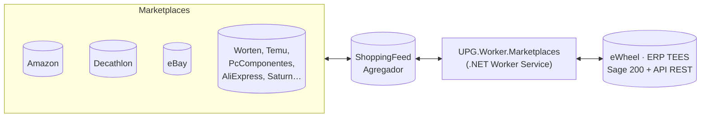

---
tags:
  - Marketplaces
  - eWheel
  - ShoppingFeed
  - Visión general
---

# Marketplaces — Visión general

Esta sección documenta el proyecto **UPG.Marketplaces**, un conector independiente de UPG.Pataky que sincroniza el ERP **eWheel** (sistema **TEES**, basado en Sage 200) con el agregador de marketplaces **ShoppingFeed**.

A diferencia de UPG.Pataky —que orquesta sus procesos con el motor de workflows **Elsa**— este proyecto es un **servicio en segundo plano de .NET** (`Worker Service`) que ejecuta sus procesos mediante **jobs programados con cron**. No hay interfaz visual tipo Elsa Studio: la observabilidad se basa en logs (NLog) y en ficheros de registro de control.

---

## ¿Qué conecta este sistema?

- **ShoppingFeed** (origen/destino de marketplaces): plataforma SaaS que centraliza la venta en múltiples marketplaces (Amazon, Decathlon, eBay, Worten, Temu, PcComponentes, AliExpress, Saturn…). El conector habla **solo con ShoppingFeed**, que a su vez se encarga de cada marketplace.
- **eWheel / TEES** (ERP): el ERP de la empresa, basado en **Sage 200**, expuesto de dos formas:
    - una **API REST** externa (crear pedidos, autenticación),
    - acceso **directo a la base de datos SQL Server** de Sage 200 (stock, tarifas de precio y albaranes mediante vistas `VIS_TEES_*`).

---

## Los cuatro procesos del sistema

El conector ejecuta cuatro procesos periódicos. Cada uno es un *Worker* con su propio cron:

| Proceso | Dirección | Cron | Qué hace |
|---|---|---|---|
| [**Stock**](mp-wf-stock.md) | ERP → SF | `15/15 * * * *` | Actualiza el stock de cada referencia publicada en ShoppingFeed con el disponible del ERP |
| [**Pedidos SF → ERP**](mp-wf-pedidos-sf-erp.md) | SF → ERP | `10/5 * * * *` | Descarga pedidos pendientes de los marketplaces y los crea en el ERP |
| [**Pedidos ERP → SF**](mp-wf-pedidos-erp-sf.md) | ERP → SF | `5/5 * * * *` | Detecta albaranes con envío en el ERP y marca los pedidos como *enviados* en ShoppingFeed |
| [**Precios**](mp-wf-precios.md) | ERP → SF | `0 10,13,16,22 * * *` | Actualiza precios en ShoppingFeed desde las tarifas del ERP *(actualmente desactivado)* |

> **Nota:** en compilación `RELEASE` solo se activan **Stock**, **Pedidos SF → ERP** y **Pedidos ERP → SF**. El Worker de Precios está comentado en `Program.cs`. Ver [Arquitectura del conector](mp-arquitectura.md#registro-y-activacion-de-workers).

---

## Los tres proyectos del repositorio

El patrón de organización es similar al de UPG.Pataky, pero adaptado a un servicio Worker:

| Proyecto | Responsabilidad |
|---|---|
| `UPG.Marketplaces.Models` | Modelos de dominio (`Order`, `Inventory`, `ProductPrice`), modelos de eWheel (`EwheelOrder`, `TarifaPrecio`, vistas de Sage) y el `DbContext` de Sage (`EwheelDbContext`) |
| `UPG.Marketplaces.Services` | La lógica de integración: el servicio `EwheelService` (ERP), el servicio `ShoppingFeedService` (marketplaces), los mapeos AutoMapper y la BD de seguimiento (`ApplicationEwheelDbContext`) |
| `UPG.Worker.Marketplaces` | El host del servicio: los cuatro Workers, el motor de scheduling (`WorkerService<T>`) y el registro de control de procesos |

> **Multi-cliente:** el repositorio contiene también integraciones para otros clientes (Hagen, GreenIce, ACOptical/Odoo, Business Central). Esta documentación se centra en la rama **eWheel + ShoppingFeed**, que es la activa en este despliegue.

---

## ¿Cómo se relaciona con UPG.Pataky?

Ambos proyectos comparten filosofía (patrón ETL, AutoMapper, modelos de pedido/stock/precio) pero difieren en el motor de ejecución:

| Aspecto | UPG.Pataky | UPG.Marketplaces |
|---|---|---|
| Motor de ejecución | Elsa Workflows | .NET Worker Service + cron |
| Origen / destino | Provalliance / SalesLayer ↔ Shopify B2B | eWheel/TEES ↔ ShoppingFeed (marketplaces) |
| Interfaz visual | Elsa Studio | — (logs + ficheros de registro) |
| Persistencia de estado | PostgreSQL (Elsa) | MySQL (`seguimiento_orders`) |
| Despliegue | Docker Compose | Servicio Windows / systemd |

---

## Cómo leer esta sección

1. Empieza por la [**Arquitectura del conector**](mp-arquitectura.md) para entender cómo arranca el servicio, cómo se inyectan las dependencias y cómo funciona el scheduling.
2. Continúa con los dos servicios: [**eWheel**](mp-ewheel.md) y [**ShoppingFeed**](mp-shoppingfeed.md), que son las dos "patas" de cada proceso.
3. Después, cada uno de los cuatro [**Procesos (Workers)**](mp-wf-stock.md), que combinan ambos servicios.
4. Los apartados transversales — [Mapeo y transformación](mp-mapeo.md), [Modelos de datos](mp-modelos.md) y [Configuración](mp-configuracion.md) — completan el detalle campo a campo.

---

## Documentos relacionados

| Documento | Contenido |
|---|---|
| [Arquitectura del conector](mp-arquitectura.md) | Worker Service, inyección de dependencias y scheduling |
| [eWheel (ERP TEES)](mp-ewheel.md) | Autenticación, creación de pedidos y acceso a Sage 200 |
| [ShoppingFeed](mp-shoppingfeed.md) | API REST, paginación, rate-limit y tickets de batch |
| [Configuración](mp-configuracion.md) | `appsettings.json` bloque a bloque |
