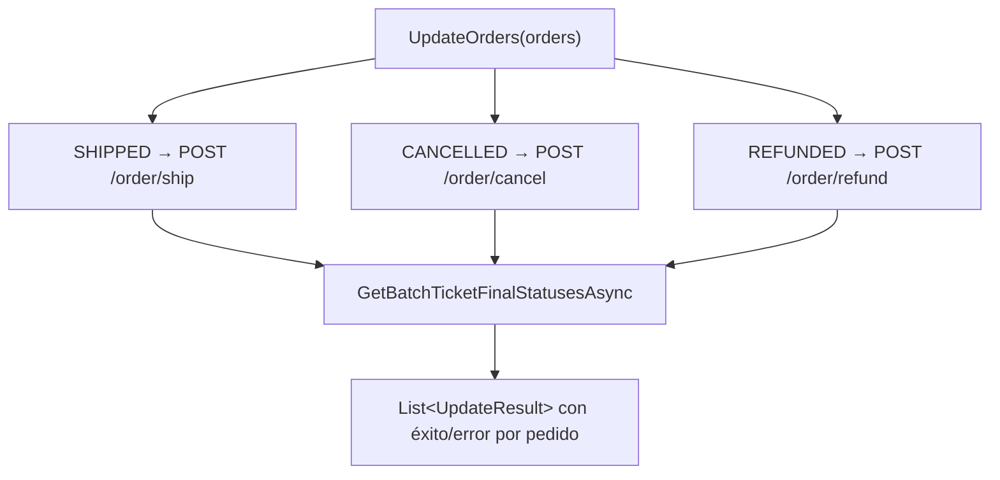

---
tags:
  - Marketplaces
  - ShoppingFeed
  - Servicios
---

# ShoppingFeed — el servicio del agregador

`ShoppingFeedService` es la capa que habla con **ShoppingFeed**, la plataforma SaaS que centraliza la venta en múltiples marketplaces. El conector nunca habla directamente con Amazon, Decathlon, eBay…: **siempre pasa por ShoppingFeed**, que abstrae cada marketplace.

El servicio se reparte en dos clases parciales más una capa de transporte:

| Clase | Fichero | Responsabilidad |
|---|---|---|
| `ShoppingFeedService` (base) | `Services/ShoppingFeedService.Base.cs` | Estado, ciclo de vida, settings |
| `ShoppingFeedService` (lógica) | `Services/ShoppingFeedService.cs` | Inventario, precios y pedidos |
| `ShoppingFeedAPIService` | `Services/ShoppingFeedAPIService.cs` | Transporte HTTP, autenticación, rate-limit, paginación |

`ShoppingFeedService` implementa `IFeedServiceSF : IFeedService`. La inyección típica en los Workers usa **`IFeedService`**.

---

## Índice

1. [Resumen](#resumen)
2. [Autenticación](#autenticacion)
3. [Concepto: catálogo / store](#concepto-catalogo-store)
4. [Operaciones de inventario y precios](#operaciones-de-inventario-y-precios)
5. [Operaciones de pedidos](#operaciones-de-pedidos)
6. [El patrón de tickets de batch](#el-patron-de-tickets-de-batch)
7. [Paginación y rate-limit](#paginacion-y-rate-limit)
8. [Documentos relacionados](#documentos-relacionados)

---

## Resumen

| Campo | Valor |
|---|---|
| **Clases** | `ShoppingFeedService` (parcial) + `ShoppingFeedAPIService` |
| **Interfaz** | `IFeedServiceSF : IFeedService` |
| **Config** | `ShoppingFeedServiceSettings` (sección homónima) |
| **API** | `<SHOPPINGFEED_BASE_URL>` |
| **Registro DI** | `AddScoped<IFeedService, ShoppingFeedService>` y `AddScoped<IRESTService, ShoppingFeedAPIService>` |

---

## Autenticación

`ShoppingFeedAPIService` admite **dos modos** (`StartService`):

1. **Por token** (preferido): si `Token` está configurado, se usa directamente como `Authorization: Bearer <token>`.
2. **Por usuario/contraseña**: si no hay token, hace `POST /v1/auth` con `grant_type=password` y recupera el `access_token`.

```json title="appsettings.json — ShoppingFeedServiceSettings"
"ShoppingFeedServiceSettings": {
  "User": "<SHOPPINGFEED_USER>",
  "Password": "<SHOPPINGFEED_PASSWORD>",
  "Token": "<SHOPPINGFEED_TOKEN>",
  "BaseURL": "<SHOPPINGFEED_BASE_URL>",
  "StoreId": "<SHOPPINGFEED_STORE_ID>",
  "GetOrderParameters": {
    "acknowledgment": "unacknowledged",
    "isTest": "false",
    "status": "waiting_shipment"
  },
  "EnableBackMarginDays": true,
  "GetOrderBackMarginDays": 7
}
```

---

## Concepto: catálogo / store

En `StartService`, el servicio fija `_catalogId = StoreId` (de la configuración). Ese identificador se usa en todos los endpoints como `store` o `catalog`. ShoppingFeed puede tener varias *stores* por cuenta; el endpoint `/v1/me` (expuesto vía `GetAccountInfo`) permite descubrirlas.

---

## Operaciones de inventario y precios

| Método | Endpoint | Descripción |
|---|---|---|
| `GetFullInventoryAsync()` | `GET /v1/catalog/{id}/inventory` | Inventario completo (paginado) como `List<Inventory>` |
| `UpdateSingleInventory(inv)` | `PUT /v1/catalog/{id}/inventory` | Actualiza el stock de una referencia |
| `UpdateBulkInventory(list)` | `PUT /v1/catalog/{id}/inventory` | Actualiza stock **por lotes** de 100 |
| `UpdateBulkPrices(list)` | `PUT /v1/catalog/{id}/pricing` | Actualiza precios **por lotes** de 100 |

Las operaciones masivas trocean la lista en páginas de `_pageSizeForUpdate` (**100**, de `SFPaginationHandler.DEFAULT_UPDATE_PAGESIZE`) y envían cada lote por separado, acumulando las respuestas. El mapeo entre los modelos de dominio (`Inventory`, `ProductPrice`) y los de la API (`SFInventoryRequest`, `SFPriceRequest`) lo hace AutoMapper.

---

## Operaciones de pedidos

| Método | Endpoint | Descripción |
|---|---|---|
| `GetOrders(parameters)` | `GET /v1/store/{id}/order` | Lista pedidos filtrados (paginado) |
| `GetChangedOrders(fromDate)` | idem con `since` | Atajo: pedidos cambiados desde una fecha |
| `GetOrder(orderId)` | `GET /v1/store/{id}/order/{id}` | Un pedido por su ID interno de SF |
| `AcknowledgeOrder(id, ref, error?)` | `POST …/order/acknowledge` | Confirma a SF que el pedido se importó (o falló) |
| `UpdateOrders(orders)` | ship / cancel / refund | Propaga cambios de estado a SF |
| `UpdateOrdersAsShipped(orders)` | `POST …/order/ship` | Marca pedidos como enviados (con tracking) |

### Filtrado de pedidos (`GetOrders`)

Los parámetros de búsqueda se combinan con los de `GetOrderParameters` de la configuración, que **prevalecen** sobre los pasados por código. Los más relevantes:

| Parámetro | Valor típico | Efecto |
|---|---|---|
| `acknowledgment` | `unacknowledged` | Solo pedidos pendientes de notificar al ERP |
| `status` | `waiting_shipment` | Solo pedidos listos para enviar (producción) |
| `isTest` | `false` | Ignora pedidos de prueba |
| `since` | fecha ISO | Pedidos a partir de esa fecha |

### Back-margin days

Si `EnableBackMarginDays` está activo, a la fecha `since` se le **restan** `GetOrderBackMarginDays` días (7 en eWheel) antes de consultar. Es una recomendación del soporte de ShoppingFeed para **no perder pedidos** por desfases de hora entre sistemas.

### Salvaguarda de pedidos de prueba

En compilación `RELEASE`, aunque los parámetros pidieran pedidos de prueba, `GetOrders` **elimina** de la respuesta todo pedido con `IsTest == true`. Es una red de seguridad para que ningún pedido de test acabe creándose en el ERP de producción.

### Cambios de estado (`UpdateOrders`)

`UpdateOrders` agrupa los pedidos por estado y llama a tres endpoints distintos según corresponda:



En la rama eWheel, el Worker [Pedidos ERP → SF](mp-wf-pedidos-erp-sf.md) usa principalmente el camino **SHIPPED**.

---

## El patrón de tickets de batch

Muchas operaciones de ShoppingFeed (acknowledge, ship, cancel, refund) son **asíncronas**: la API responde con un **ID de batch** y el resultado real hay que consultarlo después. El servicio resuelve esto con `GetBatchTicketFinalStatusesAsync`:

```text
1. POST de la operación → devuelve batchTicketId
2. Bucle: ¿está completo el batch? (IsBatchTicketComplete)
     · GET /v1/store/{id}/ticket/?batchId=...&limit=1
     · Lee meta.processing → "false" significa "todos los tickets en estado final"
3. Espera incremental entre sondeos (back-off lineal): 250 ms → … → máx 5000 ms
4. Cuando processing == "false" → GET de la lista completa de tickets del batch
5. Cada ticket individual tiene State: succeed / failed / canceled
```

Los estados de ticket relevantes son `succeed` (éxito), `failed`, `canceled`, `scheduled`, `running`. Por cada pedido se produce un `UpdateResult` con `IsSuccessful` y, si falla, el mensaje de error.

> Los endpoints `/ticket/` están **sin documentar** oficialmente; se obtuvieron por soporte directo de ShoppingFeed.

---

## Paginación y rate-limit

La clase `SFPaginationHandler` define cómo navega la API:

| Parámetro | Valor | Significado |
|---|---|---|
| Página inicial | 1 | Primera página |
| Tamaño en lectura | 200 | Ítems por página al leer (`GET`) |
| Tamaño en escritura | 100 | Ítems por lote al actualizar (`PUT`) |
| Nodo de lista | `_embedded` | Raíz donde vienen las colecciones |

El **rate-limit** (`HandleRateLimitOnResponseAsync` en `ShoppingFeedAPIService`) lee las cabeceras de respuesta:

- `X-Ratelimit-Limit: 10/2` → 10 peticiones cada 2 segundos.
- `X-Ratelimit-Remaining: 7` → peticiones restantes en la ventana actual.
- En `429 TooManyRequests` con `X-Ratelimit-Wait`, espera ese tiempo y marca el reintento.

Antes de cada petición (`HandleRateLimitBeforeRequestAsync`), decrementa un contador compartido de llamadas disponibles y, si llega a cero, espera `_rateLimitWait` ms. Todo el control es **thread-safe** mediante semáforos estáticos.

---

## Documentos relacionados

| Documento | Contenido |
|---|---|
| [eWheel (ERP TEES)](mp-ewheel.md) | La otra "pata" de cada proceso |
| [Mapeo y transformación](mp-mapeo.md) | `SFOrder → Order` y modelos `SF*` |
| [Modelos de datos](mp-modelos.md) | `Inventory`, `Order`, `ProductPrice`, `UpdateResult` |
| [Configuración](mp-configuracion.md) | `ShoppingFeedServiceSettings` |
