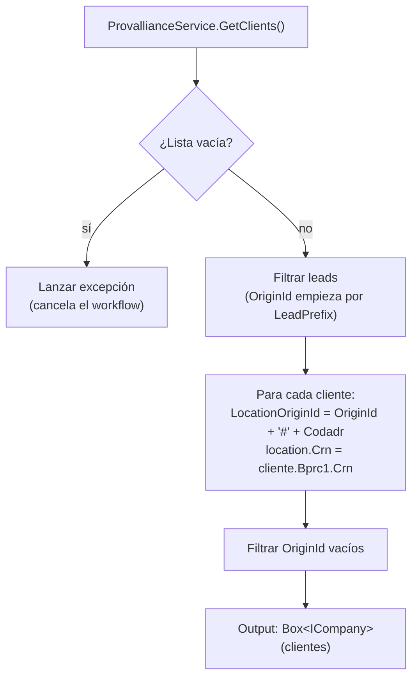

---
tags:
  - Workflows
  - Procesos
  - Clientes
  - ERP
  - Shopify
  - B2B
---

# WF-03 — Clientes: Detalle completo

---

## Índice

1. [Actividad 1 — SyncCompanies](#1-actividad-synccompanies)
2. [Actividad 2 — SyncPriceLists](#2-actividad-syncpricelists)
3. [Actividad 3 — CustomerExtract](#3-actividad-customerextract)
4. [Actividad 4 — CustomerDecision](#4-actividad-customerdecision)
5. [Actividad 5 — CustomerTransform](#5-actividad-customertransform)
6. [Actividad 6 — CompaniesWithContactsLoader](#6-actividad-companieswithcontactsloader)
7. [Jerarquía B2B de Shopify](#7-jerarquia-b2b-de-shopify)
8. [Metafields sincronizados](#8-metafields-sincronizados)
9. [Notas de diseño](#9-notas-de-diseno)

---

## 1. Actividad: `SyncCompanies`

**Clase:** `SyncCompanies` *(Loaders.Shopify.Mirror — proyecto externo)*
**Tipo:** Mirror

Realiza una bulk query de Shopify para leer todas las **Companies**, **CompanyLocations** y **CompanyContacts** y los sincroniza en TransactionsDB. Construye las tablas de correspondencias `companyOriginId ↔ shopifyId`, `locationOriginId ↔ shopifyId`, `customerOriginId ↔ shopifyId`.

---

## 2. Actividad: `SyncPriceLists`

**Clase:** `SyncPriceLists` *(Loaders.Shopify.Mirror — proyecto externo)*
**Tipo:** Mirror

Sincroniza las **PriceLists** (tarifas B2B) de Shopify en TransactionsDB. Necesaria para que `CustomerTransform` pueda asignar tarifas a las nuevas sucursales.

---

## 3. Actividad: `CustomerExtract`

**Clase:** `CustomerExtract`
**Fichero:** `Extractors/CustomerExtract.cs`
**Hereda de:** `BaseActivity<CustomerExtract>`

### ShouldRunAsync

```csharp
protected override bool ShouldRunAsync() => true;
```

Siempre se ejecuta.

### Proceso interno



> Si la lista de clientes está vacía, el workflow **cancela** con una excepción. Esto evita sincronizaciones con datos incompletos que podrían eliminar todos los clientes de Shopify.

### Output

| Variable | Tipo | Descripción |
|---|---|---|
| `ERPCompanies` | `Box<ICompany>` | Clientes del ERP filtrados y con LocationOriginId construido |

### Log de resultado

```text
Recuperados {N} clientes.
Cantidad de clientes descartados: {M}  [solo si M > 0]
```

---

## 4. Actividad: `CustomerDecision`

**Clase:** `CustomerDecision` *(Loaders — proyecto externo)*
**Tipo:** Decision

Compara la lista de clientes del ERP con el estado de Shopify (leído por el Mirror) y clasifica cada entidad en 12 outputs:

| Output | Tipo | Descripción |
|---|---|---|
| `createCompanies` | `Box<ICompany>` | Empresas nuevas |
| `updateCompanies` | `Box<(DestinoId, ICompany)>` | Empresas a actualizar |
| `deleteCompanies` | `Box<string>` | DestinoIds a eliminar |
| `createLocations` | `Box<(DestinoId, ILocation)>` | Sucursales nuevas (DestinoId = empresa padre) |
| `updateLocations` | `Box<(DestinoId, ILocation)>` | Sucursales a actualizar (DestinoId = sucursal) |
| `deleteLocations` | `Box<Location>` | Sucursales a eliminar |
| `createContacts` | `Box<(DestinoId, ICustomer)>` | Contactos nuevos (DestinoId = empresa) |
| `updateContacts` | `Box<(DestinoId, ICustomer)>` | Contactos a actualizar (DestinoId = CompanyContact) |
| `deleteContacts` | `Box<string>` | DestinoIds de CompanyContacts a eliminar |
| `mainContactAssign` | `Box<(DestinoId, ICustomer)>` | Asignación de contacto principal (DestinoId = empresa) |
| `assignRoles` | `Box<(string, ICustomer, ILocation)>` | Roles a asignar |

---

## 5. Actividad: `CustomerTransform`

**Clase:** `CustomerTransform`
**Fichero:** `Transformers/CustomerTransform.cs`
**Hereda de:** `BaseActivity<CustomerTransform>`

### ShouldRunAsync

```csharp
protected override bool ShouldRunAsync() =>
    _createCompanies.Count > 0 || _updateCompanies.Count > 0 || _deleteCompanies.Count > 0;
```

Se ejecuta si hay algún cambio en empresas. Si solo hay cambios en sucursales o contactos pero no en empresas, la actividad **se salta** (optimización para evitar procesamiento innecesario).

### Proceso interno — principales transformaciones

**Para cada empresa nueva (`createCompanies`):**
- Mapea con `AutoMapper.CustomersMappingProfile` → `CompanyInput`
- Mapea sus contactos → `CompanyContactInput[]` (teléfono a `null` en creación)
- Mapea sus sucursales → `CompanyLocationInput[]` (teléfonos a `null` en creación)
- Genera metafields de empresa, sucursal y contacto

**Para cada empresa existente (`updateCompanies`):**
- Mapea → `CompanyInput` para actualización

**Para contactos (`createContacts` / `updateContacts`):**
- Valida que el email no esté vacío (log error y descarta si es inválido)
- Mapea → `CompanyContactInput`

**Para sucursales (`updateLocations`):**
- Mapea → `CompanyLocationUpdateInput`
- Construye dirección y la asigna como `SHIPPING` y `BILLING`

**Catálogo por defecto para nuevas sucursales:**
- Si `ShopifyCredentials:DefaultPriceListId` está configurado, asigna esa tarifa a todas las nuevas sucursales

**Para roles (`assignRoles`):**
- Construye el roleOriginId compuesto por customer + location
- Filtra los que tienen OriginIds vacíos

### Output

| Variable | Tipo | Descripción |
|---|---|---|
| `inputLoader` | `CompaniesWithContactsInput` | Input consolidado para `CompaniesWithContactsLoader` |

---

## 6. Actividad: `CompaniesWithContactsLoader`

**Clase:** `CompaniesWithContactsLoader` *(Loaders.Shopify.Companies — proyecto externo)*
**Tipo:** Loader

Recibe el `CompaniesWithContactsInput` y ejecuta todas las operaciones en Shopify B2B en orden:

1. Crear Companies
2. Actualizar Companies
3. Eliminar Companies
4. Crear Locations (por empresa)
5. Actualizar Locations
6. Actualizar direcciones de Locations
7. Eliminar Locations
8. Crear Contacts (por empresa)
9. Actualizar Contacts
10. Eliminar Contacts
11. Asignar MainContact
12. Asignar Roles
13. Asignar PriceLists a nuevas Locations
14. Crear Metafields (Company, Location, Customer)

---

## 7. Jerarquía B2B de Shopify

El workflow sincroniza la jerarquía B2B completa de Shopify:

```
Company (empresa cliente)
  └── CompanyLocation (sucursal)
        └── CompanyContact (asignación de Customer a Company)
              └── Customer (persona/usuario)
                    └── Role (BUYER, ADMIN, etc.)
```

Correspondencia con el modelo ERP:

| Shopify | ERP |
|---|---|
| `Company` | Cliente (`ClientResponseModel`) |
| `CompanyLocation` | Dirección (`LocationResponseModel`) con `LocationOriginId = clienteId#codadr` |
| `Customer` | Contacto de la ubicación |
| `CompanyContact` | Asignación del contacto a la empresa |

---

## 8. Metafields sincronizados

| Entidad | Namespace | Key | Valor |
|---|---|---|---|
| `Company` | `upng` | `zona_fiscal` | Zona fiscal del cliente ERP |
| `Customer` | `upng` | `external_id` | OriginId del contacto en el ERP |

Los metafields de Location se generan vacíos (el método `GetMetafieldsLocation` devuelve lista vacía).

---

## 9. Notas de diseño

### Guardia contra lista vacía

`CustomerExtract` lanza una excepción si el ERP devuelve 0 clientes. Esta guardia existe porque una sincronización completa con 0 clientes interpretaría que **todos los clientes deben eliminarse** de Shopify — una operación destructiva irreversible.

### Teléfonos en creación vs. actualización

En la creación de contactos y sucursales, el teléfono se deja a `null` (`input.Phone = null`). En actualizaciones, se usa el valor del ERP pero se limpia si es una cadena vacía (`if (string.IsNullOrWhiteSpace(input.Phone)) input.Phone = ""`). Esto evita errores de validación de Shopify con números de teléfono inválidos durante la creación.

### Comentarios `OJO si implementamos incrementales`

El transformer incluye tres comentarios sobre los arrays de eliminación:

```csharp
// OJO si implementamos incrementales - esta opción ya no nos vale
DeleteCompanies = _deleteCompanies.ToArray(),
```

En modo incremental, no se podrían usar todos los OriginIds ausentes como "a eliminar" porque la extracción incremental no trae el universo completo. Actualmente el workflow solo funciona en modo full-sync.
