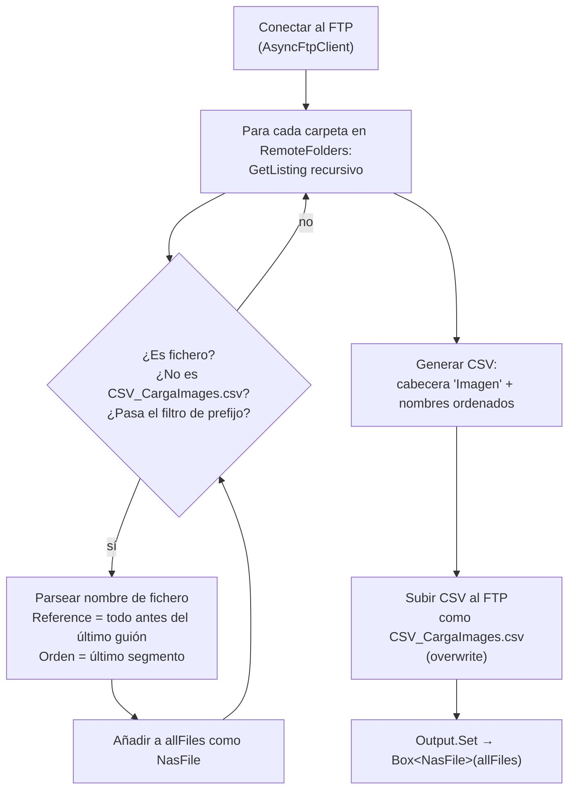

---
tags:
  - Workflows
  - Procesos
  - Imágenes
  - FTP
  - PIM
---

# WF-05 — Imágenes PIM: Detalle completo

---

## Índice

1. [Actividad 1 — LocalImagesExtractor](#1-actividad-localimagesextractor)
2. [Actividad 2 — Finish](#2-actividad-finish)
3. [Modelo NasFile](#3-modelo-nasfile)
4. [El CSV generado](#4-el-csv-generado)
5. [Configuración FTP](#5-configuracion-ftp)
6. [Notas de diseño](#6-notas-de-diseno)

---

## 1. Actividad: `LocalImagesExtractor`

**Clase:** `LocalImagesExtractor`
**Fichero:** `Extractors/PicsLocalExtractor.cs`
**Hereda de:** `BaseActivity<LocalImagesExtractor>`

Esta actividad agrupa las tres responsabilidades del workflow en una sola: **leer**, **transformar** y **escribir**. Es un extractor atípico porque no solo descarga datos — también genera un artefacto (el CSV) y lo sube al mismo sistema de origen.

### Inputs

La actividad no recibe inputs de otras actividades del workflow. Lee su configuración directamente de `IConfiguration`:

| Config key | Tipo | Descripción |
|---|---|---|
| `FtpImages:Host` | `string` | Hostname del servidor FTP |
| `FtpImages:Port` | `int` | Puerto FTP (default `21`) |
| `FtpImages:Username` | `string` | Usuario FTP |
| `FtpImages:Password` | `string` | Contraseña FTP |
| `FtpImages:RemoteFolders` | `List<string>` | Carpetas del FTP a escanear recursivamente |
| `FtpImages:UsePassive` | `bool` | Modo de conexión FTP (default `true`) |
| `FtpImages:FileNameStartsWith` | `List<string>` | Prefijos para filtrar ficheros. Si está vacío, no filtra |

### Proceso interno



### Output

| Variable | Tipo | Descripción |
|---|---|---|
| `imagenesNas` | `Box<NasFile>` | Todas las imágenes encontradas y parseadas |

### Log de resultado

```text
Recuperadas {N} imágenes agrupadas en {M} referencias.
```

Donde `N` es el número total de ficheros y `M` es el número de referencias de producto distintas (`Reference` únicos).

---

## 2. Actividad: `Finish`

**Clase:** `Finish` *(Elsa built-in)*

Actividad de Elsa que marca la instancia del workflow como finalizada con estado `Finished`. No tiene lógica propia — su única función es ser el nodo terminal del grafo para que Elsa sepa que el workflow ha completado correctamente.

> En otros workflows del proyecto el nodo terminal es una actividad personalizada de carga. Aquí se usa `Finish` directamente porque la carga (subida del CSV al FTP) ya ocurre dentro de `LocalImagesExtractor`.

---

## 3. Modelo: `NasFile`

**Fichero:** `Extractors/Models/NasFile.cs`

Representa un fichero de imagen encontrado en el servidor FTP. Se genera en `LocalImagesExtractor` y se pasa al output del workflow.

| Propiedad | Tipo | Descripción |
|---|---|---|
| `Name` | `string` | Nombre del fichero con extensión (ej: `GHD001-3.jpg`) |
| `Folder` | `string` | Carpeta remota del FTP donde está el fichero |
| `FullPath` | `string` | Ruta completa en el FTP (ej: `/smartie/sync_erp/images/import/new/GHD001-3.jpg`) |
| `Reference` | `string` | Referencia del producto: todo lo que va **antes** del último guión en el nombre sin extensión (ej: `GHD001`) |
| `Orden` | `string` | Posición de visualización: el **último segmento** tras el último guión (ej: `3`) |

### Ejemplo de parseo

| Fichero | Reference | Orden |
|---|---|---|
| `GHD001-1.jpg` | `GHD001` | `1` |
| `GHD-ALISADOR-PRO-2.jpg` | `GHD-ALISADOR-PRO` | `2` |
| `SECHE-VITE.png` | `SECHE-VITE` | `0` *(sin guión → orden por defecto)* |

> **Regla:** si el nombre no contiene guión, `Orden = "0"` y `Reference = nombre completo sin extensión`.

---

## 4. El CSV generado

El extractor genera un fichero `CSV_CargaImages.csv` y lo sube al FTP en la primera carpeta de `RemoteFolders`:

```csv title="CSV_CargaImages.csv"
Imagen
GHD001-1.jpg
GHD001-2.jpg
GHD001-3.jpg
GHD-ALISADOR-PRO-1.jpg
GHD-ALISADOR-PRO-2.jpg
```

Características del CSV:

| Característica | Valor |
|---|---|
| **Cabecera** | `Imagen` — nombre de columna que SalesLayer espera |
| **Contenido** | Un nombre de fichero por línea, sin rutas |
| **Orden** | Alfabético (`.OrderBy(x => x)`) |
| **Duplicados** | Eliminados (`.Distinct()`) |
| **Codificación** | UTF-8 |
| **Comportamiento** | Sobreescribe el fichero existente en cada ejecución (`FtpRemoteExists.Overwrite`) |
| **Ruta destino** | `{RemoteFolders[0]}/CSV_CargaImages.csv` |

> **Por qué la cabecera es `Imagen`:** SalesLayer está configurado para importar imágenes buscando una columna con ese nombre exacto en el CSV. Si se cambia el nombre de la columna hay que modificar la configuración del canal en el PIM.

---

## 5. Configuración FTP

```json title="appsettings.json"
"FtpImages": {
  "Host":               "ftp.rutilliadolfo.com",
  "Port":               21,
  "Username":           "TheHairPro",
  "Password":           "<FTP_PASSWORD>",
  "RemoteFolders":      [ "/smartie/sync_erp/images/import/new" ],
  "UsePassive":         true,
  "FileNameStartsWith": []
}
```

### Descripción de campos

| Campo | Descripción |
|---|---|
| `Host` | Hostname del servidor FTP |
| `Port` | Puerto FTP — `21` es el estándar |
| `Username` / `Password` | Credenciales de acceso al FTP |
| `RemoteFolders` | Lista de carpetas a escanear. El extractor hace `GetListing` recursivo en cada una. El CSV se sube a la **primera carpeta** de la lista |
| `UsePassive` | `true` → modo pasivo (el servidor FTP abre el puerto de datos). Necesario cuando el cliente está detrás de NAT o firewall |
| `FileNameStartsWith` | Si tiene valores, solo se procesan los ficheros cuyo nombre empieza por alguno de los prefijos. Si está vacío (`[]`), se procesan todos. En producción está vacío — filtraba `GHD` en fases anteriores |

---

## 6. Notas de diseño

### Por qué el extractor hace también la carga

Este workflow es el único del sistema donde la carga no es una actividad separada. La razón es que el artefacto que se genera (el CSV) se construye **a partir de los mismos datos** que se acaban de leer del FTP, en la misma sesión de conexión abierta. Separarlo en dos actividades habría requerido serializar y deserializar la lista de ficheros, y abrir una segunda conexión FTP para subir el CSV.

### La variable `saleslayerInput` no conectada

El workflow define una variable `saleslayerInput: SalesLayerInput` que nunca se pasa a ninguna actividad. Esto es un vestigio de una versión anterior del workflow en la que existía una actividad separada que registraba las imágenes directamente en SalesLayer vía API. Esa actividad fue eliminada y el registro pasó a hacerse mediante el CSV, pero la variable quedó en el código.

No tiene efecto en el comportamiento del workflow.
