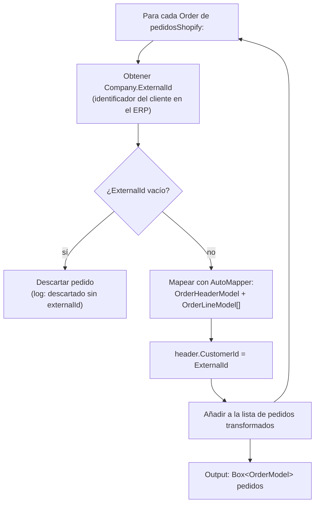

---
tags:
  - Workflows
  - Procesos
  - Pedidos
  - Shopify
  - ERP
---

# WF-04 — Pedidos: Detalle completo

---

## Índice

1. [Actividad 1 — OrdersExtractor](#1-actividad-ordersextractor)
2. [Actividad 2 — OrderTransform](#2-actividad-ordertransform)
3. [Actividad 3 — LoadOrders](#3-actividad-loadorders)
4. [Actividad 4 — OrdersLoader](#4-actividad-ordersloader)
5. [Modelos de pedido](#5-modelos-de-pedido)
6. [Mecanismo de idempotencia (tag)](#6-mecanismo-de-idempotencia-tag)
7. [Notas de diseño](#7-notas-de-diseno)

---

## 1. Actividad: `OrdersExtractor`

**Clase:** `OrdersExtractor` *(Loaders.Shopify.Orders — proyecto externo)*
**Tipo:** Extractor — Mirror

Realiza una bulk query GraphQL sobre Shopify para recuperar los pedidos que **no tienen la tag de sincronización**. La query de filtro se lee de `FilterOrders:query` (por defecto `tag_not:Sincronizado`).

### Output

| Variable | Tipo | Descripción |
|---|---|---|
| `pedidosShopify` | `Box<Order>` | Pedidos de Shopify sin procesar, con líneas, cliente y empresa |

---

## 2. Actividad: `OrderTransform`

**Clase:** `OrderTransform`
**Fichero:** `Transformers/OrderTransform.cs`
**Hereda de:** `BaseActivity<OrderTransform>`

### ShouldRunAsync

```csharp
protected override bool ShouldRunAsync() => _input.Count > 0;
```

### Proceso interno



El `ExternalId` de la empresa en Shopify debe coincidir con el identificador de cliente en el ERP. Si no está presente, el pedido no puede enviarse al ERP y se descarta.

### Output

| Variable | Tipo | Descripción |
|---|---|---|
| `pedidos` | `Box<OrderModel>` | Pedidos con cabecera (`OrderHeaderModel`) y líneas (`OrderLineModel[]`) |

### Logs de resultado

```text
Transformados {N} pedidos de Shopify.
Descartados {M} pedidos sin externalId de cliente.
Transformadas {K} lineas de pedido.
```

---

## 3. Actividad: `LoadOrders`

**Clase:** `LoadOrders`
**Fichero:** `Extractors/Models/Orders/LoadOrders.cs`
**Hereda de:** `BaseActivity<LoadOrders>`

> A pesar de estar en `Extractors/Models/Orders/`, esta clase es un **transformer-loader**: recibe pedidos transformados, los envía al ERP y produce el input para el siguiente loader.

### ShouldRunAsync

```csharp
protected override bool ShouldRunAsync() => _orders.Count > 0;
```

### Proceso interno

Para cada `OrderModel`:

1. Llama a `ProvallianceService.PostOrder(order.Header)` — envía el pedido al ERP.
2. Si tiene éxito: registra el pedido en `TransactionsDB.Orders` y añade la tag de sincronización al mapa `addTags`.
3. Si falla: registra el error en `TransactionsDB.Orders` con el mensaje de error y añade el error al log de la actividad. **No interrumpe el bucle** — continúa con el siguiente pedido.

### Determinación de la tag de sincronización

La tag se lee de `FilterOrders:query`. Si el valor es `tag_not:Sincronizado`, la tag aplicada será `"Sincronizado"`. Si el prefijo `tag_not:` no está presente, la tag por defecto es `"Sincronizado"`.

### Output

| Variable | Tipo | Descripción |
|---|---|---|
| `inputLoader` | `OrdersLoaderInput` | Mapa `shopifyOrderId → Set<string>` de tags a añadir en Shopify |

### Logs de resultado

```text
Pedidos recibidos para carga: {N}.
Pedidos cargados correctamente en Provalliance: {OK}.
Pedidos con error en carga Provalliance: {ERR}.
Pedidos preparados para etiquetar en Shopify: {TAG}.
```

---

## 4. Actividad: `OrdersLoader`

**Clase:** `OrdersLoader` *(Loaders.Shopify.Orders — proyecto externo)*
**Tipo:** Loader

Recibe `OrdersLoaderInput.AddTags` y llama a la API de Shopify para añadir las tags especificadas a cada pedido. Solo se llaman los pedidos que se enviaron correctamente al ERP — los fallidos no tienen entry en `addTags`.

---

## 5. Modelos de pedido

### `OrderModel`

Contenedor principal de un pedido procesado.

| Propiedad | Tipo | Descripción |
|---|---|---|
| `ShopifyOrder` | `Order` | Pedido bruto de Shopify (para obtener el Id Shopify) |
| `Header` | `OrderHeaderModel` | Cabecera del pedido para el ERP |
| `Lines` | `OrderLineModel[]` | Líneas del pedido |

### `OrderHeaderModel`

**Fichero:** `Extractors/Models/Orders/Models/OrderHeaderModel.cs`

Cabecera de pedido en el formato que espera el ERP. Incluye:

| Campo clave | Descripción |
|---|---|
| `Id` | Número de pedido de Shopify (`order.Name`, ej: `#SS4185`) |
| `CustomerId` | ExternalId del cliente en el ERP |
| `LineasDocumento` | Array de `OrderLineModel` |
| Dirección de envío | Campos de `OrderShippingAddressModel` |

### `OrderLineModel`

**Fichero:** `Extractors/Models/Orders/Models/OrderLineModel.cs`

Línea de producto del pedido. Contiene SKU, cantidad, precio unitario y descuentos.

---

## 6. Mecanismo de idempotencia (tag)

El sistema usa la tag de Shopify como mecanismo de idempotencia:

```text
1. Shopify tiene pedidos sin tag "Sincronizado"
2. OrdersExtractor los recupera (query: tag_not:Sincronizado)
3. LoadOrders los envía al ERP
4. Para los que tienen éxito, prepara addTags: { orderId → ["Sincronizado"] }
5. OrdersLoader añade la tag en Shopify
6. En la siguiente ejecución, esos pedidos ya NO aparecen en la query
   → no se vuelven a enviar al ERP
```

Los pedidos que fallaron en el ERP **no reciben la tag** — volverán a aparecer en la siguiente ejecución y se reintentará su envío.

---

## 7. Notas de diseño

### Dirección inversa

Este es el único workflow del sistema con flujo Shopify → ERP. Todos los demás van de fuente externa (ERP/PIM) hacia Shopify.

### Resiliencia por pedido

`LoadOrders` procesa cada pedido individualmente con `try/catch`. Un error en un pedido no cancela el workflow completo — se sigue procesando el resto y el pedido fallido se documenta en el log y en TransactionsDB.

### Modo debug

`OrderTransform` tiene un bloque `#if DEBUG` que filtra los pedidos a procesar a una lista predefinida de nombres (`#SS4185`). Esto permite probar el transformer sin enviar todos los pedidos al ERP durante el desarrollo.
