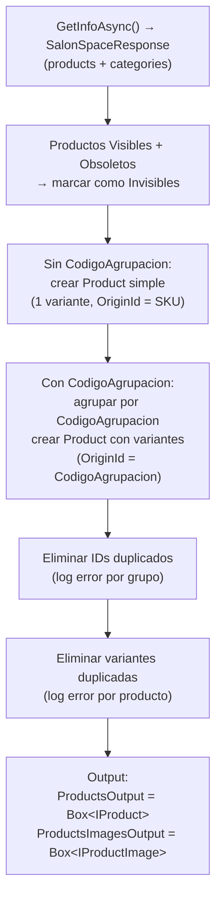
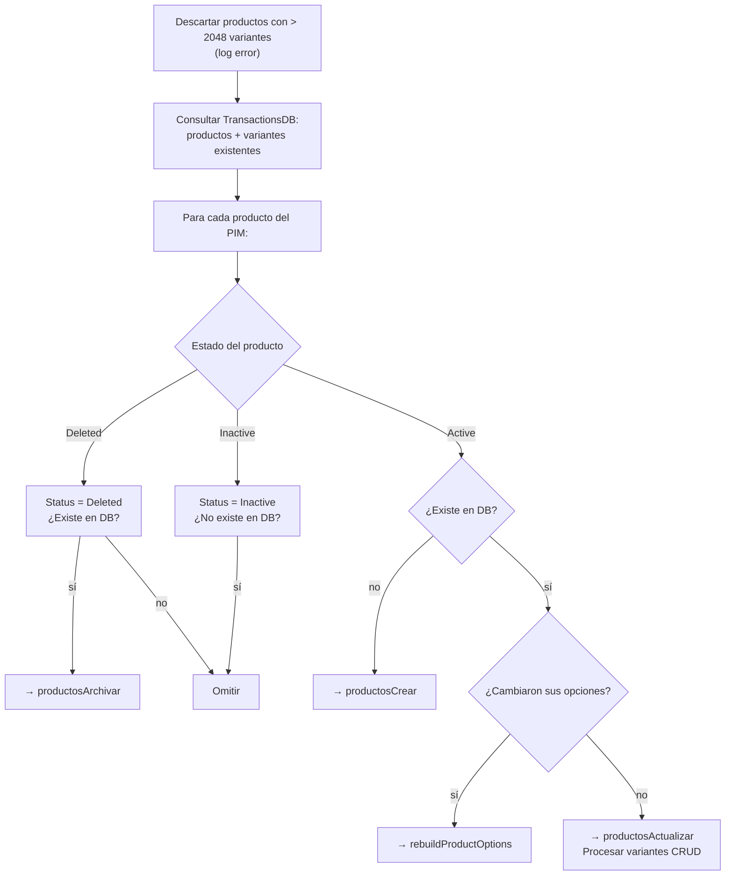

---
tags:
  - Workflows
  - Procesos
  - Productos
  - PIM
  - Shopify
---

# WF-01 — Productos: Detalle completo

---

## Índice

1. [Actividad 1 — SyncProducts](#1-actividad-syncproducts)
2. [Actividad 2 — ProductsWithImagesExtract](#2-actividad-productswithimagesextract)
3. [Actividad 3 — ProductsRebuildDecision](#3-actividad-productsrebuilddecision)
4. [Rama Crear: Transform + Load](#4-rama-crear-transform-load)
5. [Rama Actualizar: Transform + Load](#5-rama-actualizar-transform-load)
6. [Rama Eliminar: Transform + Load](#6-rama-eliminar-transform-load)
7. [Modelo Product / Variant](#7-modelo-product-variant)
8. [Notas de diseño](#8-notas-de-diseno)

---

## 1. Actividad: `SyncProducts`

**Clase:** `SyncProducts` *(Loaders.Shopify.Mirror — proyecto externo)*
**Tipo:** Mirror

Realiza una bulk query de Shopify para leer todos los **Products**, **ProductVariants** y sus **ProductOptions**, y los sincroniza en TransactionsDB. Construye la tabla `productOriginId ↔ shopifyProductId` y `variantOriginId ↔ shopifyVariantId`.

Esta tabla es fundamental para las 3 ramas del workflow: sin ella no se pueden resolver los IDs de Shopify de los productos/variantes existentes.

---

## 2. Actividad: `ProductsWithImagesExtract`

**Clase:** `ProductsWithImagesExtract`
**Fichero:** `Extractors/ProductsWithImagesExtract.cs`
**Hereda de:** `BaseActivity<ProductsWithImagesExtract>`

Lee el catálogo completo del canal PIM (`PIM:CanalSalida`, usando `SalesLayerClientService.GetService("CanalSalida")`).

### Proceso de construcción de productos



### Outputs

| Variable | Tipo | Descripción |
|---|---|---|
| `productos` | `Box<IProduct>` | Todos los productos del PIM (simples y con variantes) |
| *(ignorado)* | `Box<IProductImage>` | Imágenes — usadas en WF-06, descartadas aquí |

### Logs de resultado

```text
Recuperados {N} productos del PIM con estados: Active (X), Inactive (Y), Deleted (Z).
Recuperadas {V} variantes totales.
Recuperadas {I} imágenes.
```

---

## 3. Actividad: `ProductsRebuildDecision`

**Clase:** `ProductsRebuildDecision`
**Fichero:** `Decisions/ProductsRebuildDecision.cs`
**Hereda de:** `BaseActivity<ProductsRebuildDecision>`

### ShouldRunAsync

```csharp
protected override bool ShouldRunAsync() => _productos is { Count: > 0 };
```

### Proceso interno



**Post-procesamiento de eliminaciones:**
- Productos en TransactionsDB pero ausentes en el PIM → `productosArchivar`
- Variantes en TransactionsDB pero ausentes en el PIM → `variantesBorrar`
- Si un producto tiene **todas** sus variantes en `variantesBorrar` → se mueve el producto a `productosBorrar` (borrado definitivo) o `productosArchivar`
- Si el producto ya va a archivarse/borrarse → se suprimen las eliminaciones de sus variantes individuales

### Límite de variantes

```csharp
private const int MaxNumVariants = 2048;
```

Productos con más de 2048 variantes se descartan antes de procesar. Shopify tiene este límite y procesar un producto que lo supera causaría errores en los loaders.

### Outputs (8)

| Variable | Tipo | Descripción |
|---|---|---|
| `productosCrear` | `Box<IProduct>` | Productos nuevos a crear |
| `productosActualizar` | `Box<IProduct>` | Productos a actualizar |
| `productosArchivar` | `Box<string>` | OriginIds de productos a archivar |
| `productosBorrar` | `Box<string>` | OriginIds de productos a borrar |
| `variantesCrear` | `Box<IVariant>` | Variantes nuevas de productos ya existentes |
| `variantesActualizar` | `Box<IVariant>` | Variantes a actualizar |
| `variantesBorrar` | `Box<string>` | OriginIds de variantes a eliminar |
| `rebuildProductOptionsDecision` | `Box<IProduct>` | Productos cuyas opciones cambiaron |

---

## 4. Rama Crear: Transform + Load

### `ProductsCreateTransform`

**Fichero:** `Transformers/Products/ProductsCreateTransform.cs`

Procesa `productosCrear` + `variantesCrear`. Para cada producto nuevo:
- Mapea con `ProductosMappingTransforms` → `ProductCreateInput`
- Descarta si no tiene ProductOptions
- Mapea variantes → `ProductVariantsBulkInput[]` (sin imágenes aún)
- Descarta variantes sin OptionValues

Para variantes de productos ya existentes (`variantesCrear`):
- Busca el `shopifyProductId` del padre en TransactionsDB
- Mapea variantes → input

Output: `ProductsWithVariantsCreateLoaderInput` con `{ Products, Variants, PublishProducts: true }`

### `ProductsWithVariantsCreate`

Loader externo. Ejecuta en Shopify:
1. `productCreate` por cada producto nuevo (con variantes)
2. `productVariantsBulkCreate` por cada grupo de variantes nuevas de productos existentes
3. Registra los nuevos IDs en TransactionsDB

---

## 5. Rama Actualizar: Transform + Load

### `ProductsUpdateTransform`

**Fichero:** `Transformers/Products/ProductsUpdateTransform.cs`

La más compleja de las tres ramas. Gestiona:

**Productos a actualizar (`productosActualizar`):**
- Mapea → `ProductUpdateInput` con Id Shopify resuelto

**Variantes a actualizar (`variantesActualizar`):**
- Resuelve ShopifyId del producto padre y la variante
- Busca las imágenes Shopify asociadas a la variante (via `TransactionsDB.Medias`) para actualizar la galería

**Reconstrucción de opciones (`rebuildProductOptions`):**
- Para productos cuyas opciones cambiaron, mapea **todas** las variantes de nuevo con sus imágenes actuales
- Agrupa por `shopifyProductId`

**Archivado (`productosArchivar`):**
- Llama a Shopify para leer el status actual del producto
- Si ya está `ARCHIVED`, lo omite
- Si no, genera un `ProductUpdateInput` con `Status = ARCHIVED` y un `Handle` único (añade fecha y número random para evitar colisiones)
- Usa `UpsertProductToUpdate` para no duplicar productos en la lista

Output: `ProductsWithVariantsUpdateLoaderInput` con `{ Products, Variants, RebuildProductOptions }`

### `ProductsWithVariantsUpdate`

Loader externo. Actualiza productos y variantes en Shopify. Para los productos en `RebuildProductOptions`, elimina y recrea las opciones y las variantes.

---

## 6. Rama Eliminar: Transform + Load

### `ProductsDeleteTransform`

**Fichero:** `Transformers/Products/ProductsDeleteTransform.cs`

Resuelve los ShopifyIds de productos y variantes a borrar:

- `productosBorrar` OriginIds → ShopifyIds via TransactionsDB
- `variantesBorrar` OriginIds → ShopifyIds + ShopifyId del producto padre via TransactionsDB

Los elementos sin ShopifyId en TransactionsDB se descartan con `LogWarning`.

Output: `ProductsWithVariantsDeleteLoaderInput` con `{ ProductsToDelete, VariantsToDelete }`

### `ProductsWithVariantsDelete`

Loader externo. Ejecuta `productDelete` y `productVariantsBulkDelete` en Shopify. Limpia las entradas correspondientes de TransactionsDB.

---

## 7. Modelo: `Product` / `Variant`

**Fichero:** `Extractors/Models/Product.cs`

| Propiedad | Tipo | Descripción |
|---|---|---|
| `OriginId` | `string` | Para productos simples = SKU. Para agrupados = `CodigoAgrupacion` |
| `Status` | `EntityStatus` | Se deriva de las variantes: Active > Inactive > Deleted |

**Productos simples vs. con variantes:**

| Tipo | PIM | OriginId | Variantes |
|---|---|---|---|
| Simple | `CodigoAgrupacion` vacío | = SKU del producto | 1 variante con opciones `{ "Title": "Default Title" }` |
| Con variantes | `CodigoAgrupacion` definido | = `CodigoAgrupacion` | N variantes, opciones del campo `Agrupacion` |

---

## 8. Notas de diseño

### ¿Por qué `productsToExcludeFromMarkets` no está conectada?

La variable `productsToExcludeFromMarkets: PriceListsB2CLoaderInput` está definida en el workflow pero ninguna actividad la escribe ni la lee. Es un vestigio de una lógica de exclusión de productos de mercados B2C que quedó incompleta. No tiene efecto en el comportamiento actual.

### Archivado vs. borrado

El sistema diferencia entre archivar y borrar:
- **Archivar** (`ARCHIVED`): el producto queda en Shopify pero invisible. Reversible. Se usa para productos que dejaron de estar en el PIM pero siguen existiendo en pedidos o histórico.
- **Borrar** (delete): eliminación definitiva. Solo se usa cuando el producto tenía exactamente 1 variante con OriginId terminando en `-$` (indica que la variante fue creada como placeholder y el proceso de carga falló). En el resto de casos se archiva.

### Imágenes en `ProductsCreateTransform`

Al crear productos, las variantes no incluyen imágenes en su `ProductVariantsBulkInput` porque las imágenes aún no existen en Shopify (las sube el workflow de **Imágenes Shopify**). Los campos de galería de variantes se rellenan en la siguiente ejecución de `ProductsUpdateTransform`, cuando el Mirror ya tiene los ShopifyIds de las medias.
