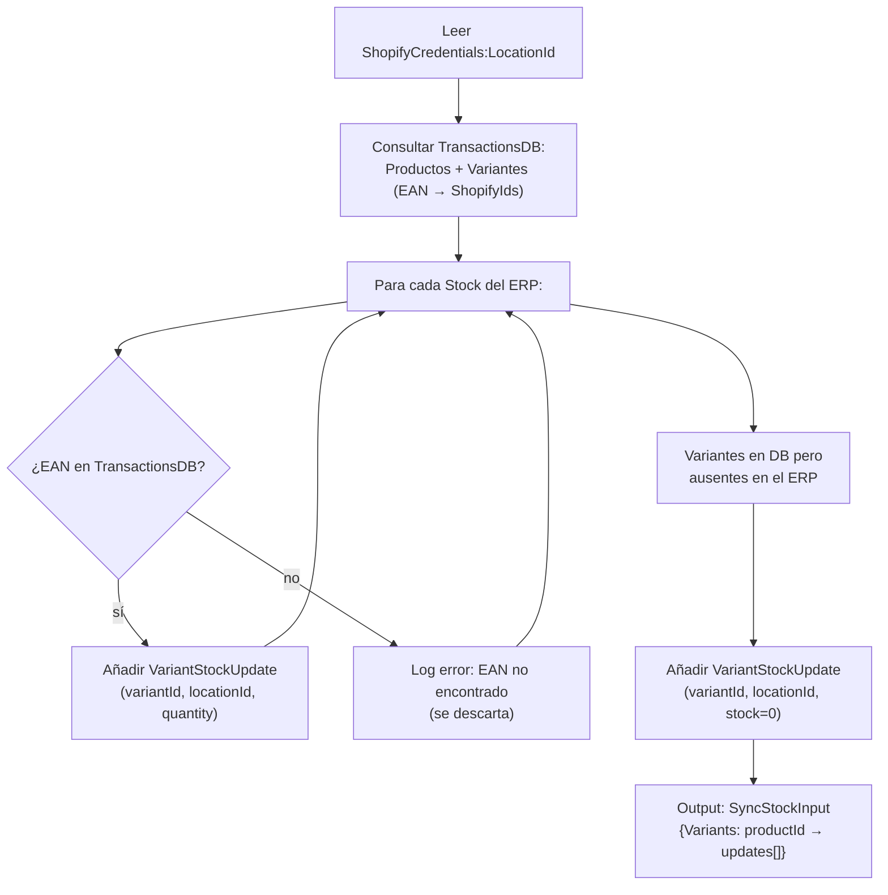

---
tags:
  - Workflows
  - Procesos
  - Stock
  - ERP
  - Shopify
---

# WF-02 — Stock: Detalle completo

---

## Índice

1. [Actividad 1 — StockExtract](#1-actividad-stockextract)
2. [Actividad 2 — StockTransform](#2-actividad-stocktransform)
3. [Actividad 3 — SyncStock](#3-actividad-syncstock)
4. [Modelo Stock](#4-modelo-stock)
5. [Lógica de cero-stock](#5-logica-de-cero-stock)
6. [Notas de diseño](#6-notas-de-diseno)

---

## 1. Actividad: `StockExtract`

**Clase:** `StockExtract`
**Fichero:** `Extractors/StockExtract.cs`
**Hereda de:** `BaseActivity<StockExtract>`

### Inputs

No recibe inputs del workflow. Lee directamente de `ProvallianceService`.

### Proceso interno

1. Llama a `ProvallianceService.GetStock()` via `FuncUtils.WithCachedRun` (caché en disco para modo debug).
2. Devuelve el resultado directamente sin transformación.

### Output

| Variable | Tipo | Descripción |
|---|---|---|
| `extractedStock` | `Box<Stock>` | Lista de registros `{ Ean, Warehouse, Quantity }` del ERP |

### Log de resultado

```text
Recuperados el stock de {N} variantes del middleware.
```

---

## 2. Actividad: `StockTransform`

**Clase:** `StockTransform`
**Fichero:** `Transformers/StockTransform.cs`
**Hereda de:** `BaseActivity<StockTransform>`

### ShouldRunAsync

```csharp
protected override bool ShouldRunAsync() => _input is { Count: > 0 };
```

Si el ERP no devuelve ningún registro de stock, la actividad se salta y no se ejecuta ninguna actualización en Shopify.

### Proceso interno



### Output

| Variable | Tipo | Descripción |
|---|---|---|
| `transformedStock` | `SyncStockInput` | Diccionario `productShopifyId → VariantStockUpdate[]` listo para el loader |

### Estructura de `SyncStockInput`

```csharp
{
    Variants: Dictionary<string, VariantStockUpdate[]>
    // key: ShopifyId del producto
    // value: array de {IdShopifyVariant, LocationId, Stock}
}
```

### Logs de resultado

```text
Transformado el stock de {N} productos.
Establecido a 0 el stock de {M} variantes porque no se recibieron de la extracción. EANs: ...
```

---

## 3. Actividad: `SyncStock`

**Clase:** `SyncStock` *(Loaders.Shopify.Stock — proyecto externo)*
**Tipo:** Loader

Recibe el `SyncStockInput` y llama a la API de Shopify para actualizar los niveles de inventario con la mutación `inventorySetQuantities`. Agrupa las actualizaciones por producto para minimizar el número de llamadas a la API.

---

## 4. Modelo: `Stock`

**Fichero:** `Extractors/Models/Stock.cs`

```csharp
public struct Stock
{
    public required string Ean      { get; init; }
    public required string Warehouse { get; init; }
    public required int    Quantity  { get; init; }
}
```

| Propiedad | Descripción |
|---|---|
| `Ean` | Código EAN de la variante. Es la clave de búsqueda en TransactionsDB |
| `Warehouse` | Almacén de origen. Actualmente el sistema no filtra por almacén; se suma todo |
| `Quantity` | Unidades disponibles |

> El modelo usa `struct` (tipo de valor) porque los registros de stock son datos inmutables y planos, sin referencias a otros objetos.

---

## 5. Lógica de cero-stock

Una parte clave de `StockTransform` es el manejo de variantes **ausentes** en la respuesta del ERP:

```text
Situación: la variante con SKU "GHD001-1" está en TransactionsDB (ya existe en Shopify)
          pero NO aparece en la respuesta de GetStock()

Acción:    Se genera un VariantStockUpdate con Stock = 0 para esa variante
Motivo:    Si el ERP no informa de una variante, se asume que no tiene stock
           (agotado, descatalogado, etc.) — es más seguro poner a 0 que dejarlo
           con el valor anterior
```

El log de advertencia indica los EANs afectados, lo que permite identificar discontinuidades entre el catálogo del ERP y el de Shopify.

---

## 6. Notas de diseño

### ¿Por qué no hay Mirror en Stock?

El workflow de Stock no necesita Mirror porque no usa el estado actual de Shopify para decidir qué actualizar. El mecanismo es más simple: el ERP es la fuente de verdad absoluta y se aplica su estado completo en cada ejecución.

### Múltiples almacenes

El modelo `Stock` incluye el campo `Warehouse`, pero `StockTransform` no lo usa para filtrar ni separar por sucursal de Shopify. Toda la cantidad se aplica a la única `LocationId` configurada en `ShopifyCredentials`. Si en el futuro se necesita mapear almacenes a sucursales, sería necesario ampliar tanto el transformer como la configuración.

### `FuncUtils.WithCachedRun`

`StockExtract` usa esta utilidad para guardar la respuesta en disco (`tmp/debug/provalliance/middleware/stock.json`) durante el desarrollo. En producción el caché está desactivado y cada ejecución llama al ERP en tiempo real.
